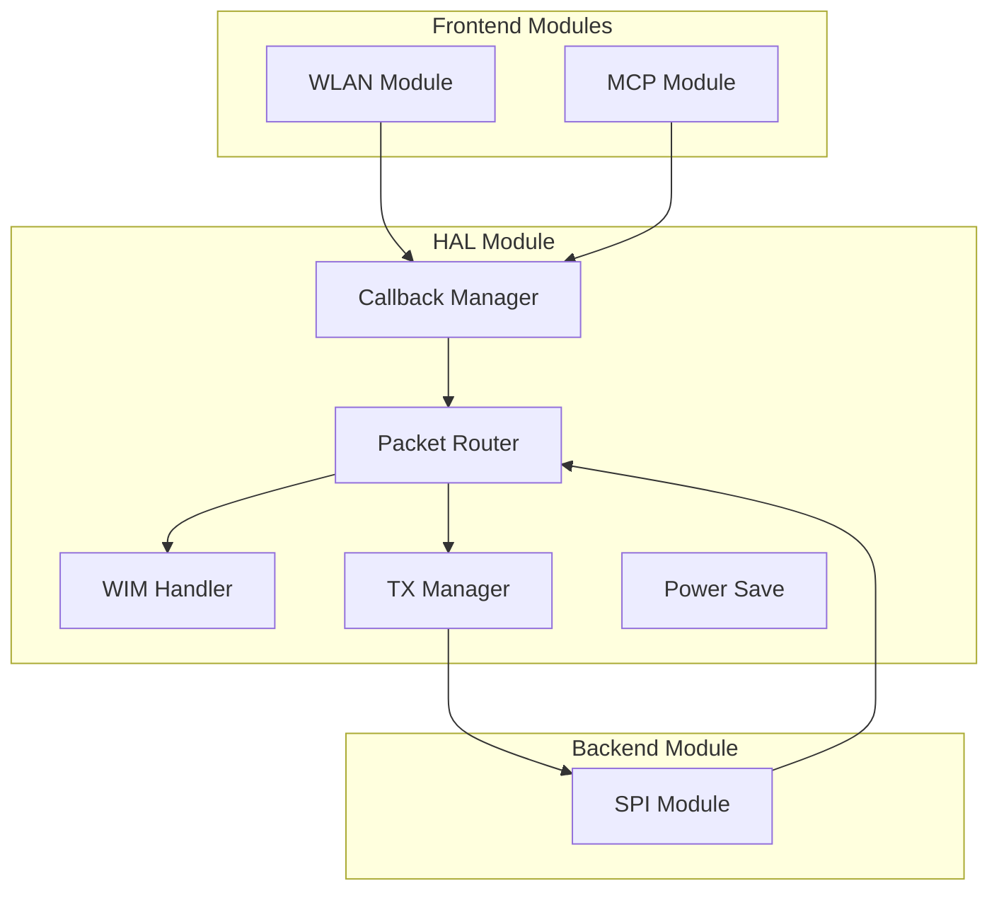
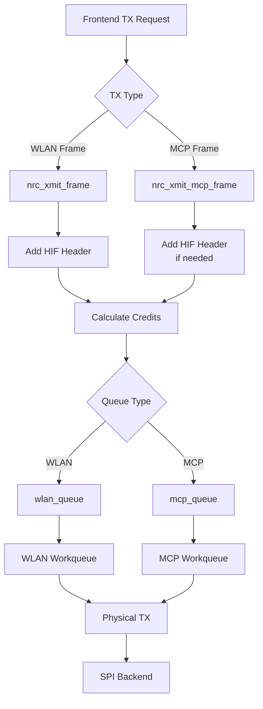
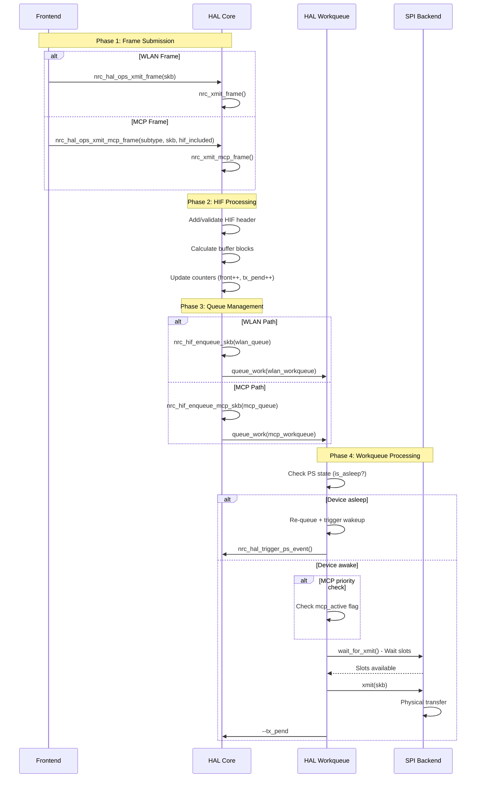
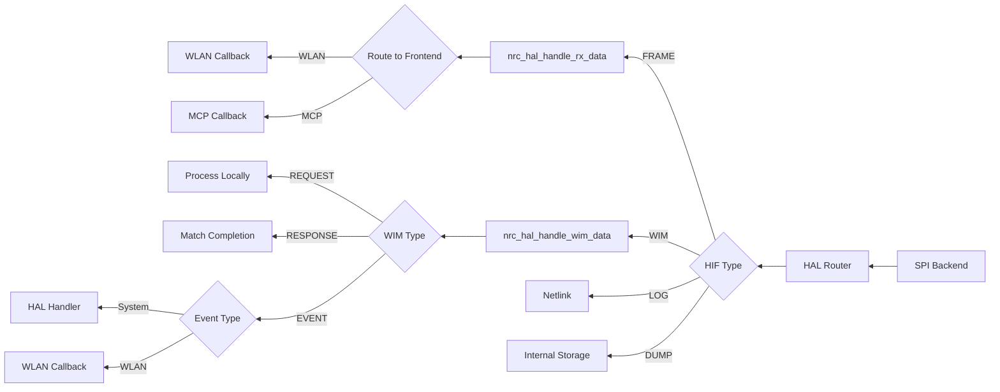
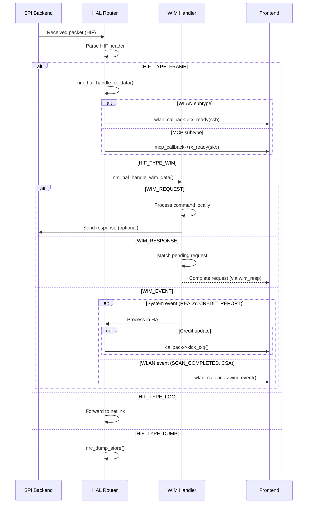
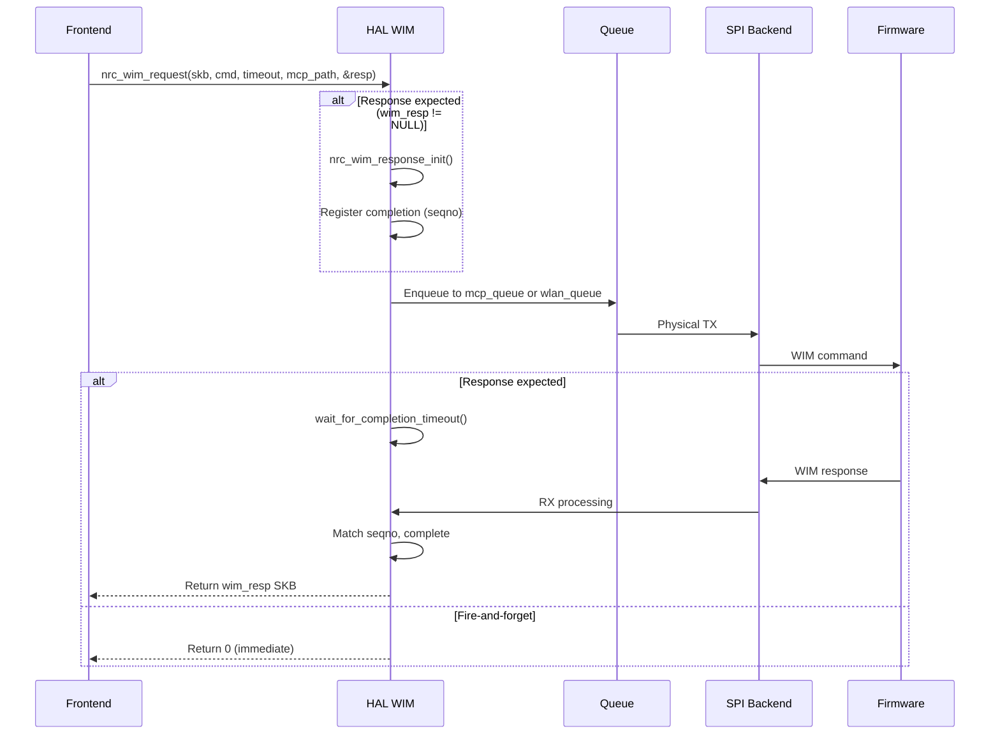
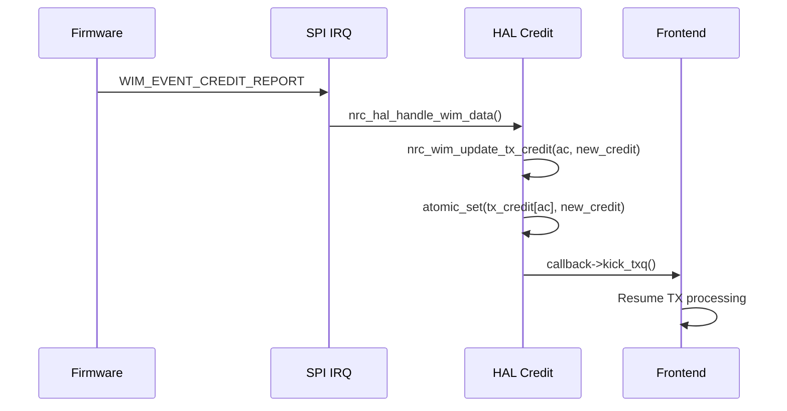

# NRC Modular Driver - HAL Layer

## Overview

The HAL (Hardware Abstraction Layer) module (`nrc_core.ko`) provides hardware abstraction, intelligent packet routing, and WIM protocol management.

**Module Type**: Core  
**Purpose**: Abstract hardware, route packets, manage WIM protocol  
**Position**: Between frontends (WLAN/MCP) and backend (SPI)

## Architecture



## TX Data Flow

### HAL TX Overview


### Complete TX Sequence


### TX Processing Functions

#### Frame Submission
```c
// WLAN frame transmission
int nrc_xmit_frame(struct nrc_hif_device *hdev, struct nrc *nw,
                   int vif_id, struct sk_buff *skb);

// MCP frame transmission with optional HIF header
int nrc_xmit_mcp_frame(struct nrc_hif_device *hdev,
                       u8 subtype, struct sk_buff *skb,
                       bool hif_header_included);
```

#### HIF Header Management
```c
// Add HIF header to frame
struct hif *nrc_add_hif_header(struct sk_buff *skb, u8 type, u8 subtype,
                               u8 vifindex, u16 len);

// Validate existing HIF header
bool nrc_validate_hif_header(struct sk_buff *skb);
```

#### Queue Management
```c
// Enqueue to WLAN queue
int nrc_hif_enqueue_skb(struct nrc_hif_device *hdev,
                        enum nrc_hif_frame_type type,
                        struct sk_buff *skb);

// Enqueue to MCP queue
int nrc_hif_enqueue_mcp_skb(struct nrc_hif_device *hdev,
                            u8 priority, struct sk_buff *skb);
```

#### Workqueue Handlers
```c
// WLAN TX workqueue handler
void nrc_hif_wlan_work(struct work_struct *work);

// MCP TX workqueue handler  
void nrc_hif_mcp_work(struct work_struct *work);
```

### HIF Header Structure
```c
struct hif {
    u8 type;      // HIF_TYPE_FRAME, HIF_TYPE_WIM, etc.
    u8 subtype;   // Frame/WIM subtype
    u8 vifindex;  // Virtual interface index
    u16 len;      // Payload length
    u8 tlv_len;   // TLV length (WIM only)
} __packed;
```

### HIF Types and Subtypes
| Type | Value | Subtypes | Purpose |
|------|-------|----------|---------|
| **HIF_TYPE_FRAME** | 0 | WLAN, MCP_DATA, MCP_PROTOCOL | Data frames |
| **HIF_TYPE_WIM** | 1 | REQUEST, RESPONSE, EVENT | WIM protocol |
| **HIF_TYPE_LOG** | 2 | - | Firmware logs |
| **HIF_TYPE_DUMP** | 3 | - | Memory dumps |

### Credit Calculation
```c
// In nrc_xmit_frame()
int buffer_size = hdev->buffer_size;  // Typically 1536 bytes
int nr_blocks = DIV_ROUND_UP(skb->len, buffer_size);

// Update counters
atomic_inc(&nw->tx_pend[ac]);
nw->front[ac]++;
```

## RX Data Flow

### HAL RX Overview


### Complete RX Sequence


### RX Processing Functions

#### Main RX Router
```c
// Main RX data routing
void nrc_hal_handle_rx_data(struct nrc_hif_device *hdev, 
                            struct sk_buff *skb);

// WIM packet routing
void nrc_hal_handle_wim_data(struct nrc_hif_device *hdev,
                             struct sk_buff *skb);
```

#### WIM Processors
```c
// Process WIM request
void nrc_hal_process_wim_request(struct nrc_hif_device *hdev,
                                 struct sk_buff *skb);

// Process WIM response (match with pending)
void nrc_hal_process_wim_response(struct nrc_hif_device *hdev,
                                  struct sk_buff *skb);

// Process WIM event
void nrc_hal_process_wim_event(struct nrc_hif_device *hdev,
                               struct sk_buff *skb);
```

#### Callback Invocation
```c
// Invoke frontend RX callback
if (hdev->callback[frontend_type].rx_ready) {
    hdev->callback[frontend_type].rx_ready(priv, skb);
}

// Invoke WIM event callback
if (hdev->callback[frontend_type].wim_event) {
    hdev->callback[frontend_type].wim_event(priv, event_id, skb);
}
```

## WIM Protocol Management

### WIM Structure
```c
struct wim {
    struct hif hif;         // HIF header
    u16 cmd;                // WIM command
    u16 seqno;              // Sequence number
    struct wim_tlv tlvs[];  // TLV payload
} __packed;

struct wim_tlv {
    u16 t;  // Type
    u16 l;  // Length
    u8 v[]; // Value
} __packed;
```

### WIM Request/Response

#### Unified WIM Request
```c
// Core WIM request handler with optional response
int nrc_wim_request(struct nrc_hif_device *hdev,
                    struct sk_buff *wim_skb,
                    u16 cmd,
                    u32 timeout,
                    bool use_mcp_path,
                    struct sk_buff **wim_resp);
```

**Parameters**:
- `wim_skb`: Pre-built WIM packet
- `cmd`: WIM command (0 = auto-detect from header)
- `timeout`: Response timeout in ms (0 = no wait)
- `use_mcp_path`: Use MCP queue (true) or WLAN queue (false)
- `wim_resp`: Output response SKB (NULL if not needed)

**Return**: 0 on success, -errno on failure

#### WIM Request Flow


#### WIM Response Matching
```c
// Initialize response tracking
struct wim_resp *nrc_wim_response_init(struct nrc_hif_device *hdev,
                                       u16 seqno);

// Complete pending response
void nrc_wim_response_complete(struct nrc_hif_device *hdev,
                               u16 seqno, struct sk_buff *skb);

// Cleanup on timeout
void nrc_wim_response_timeout(struct nrc_hif_device *hdev, u16 seqno);
```

### WIM Builder Functions
```c
// Allocate WIM SKB
struct sk_buff *nrc_wim_alloc_skb(struct nrc_hif_device *hdev,
                                  u16 cmd, u16 len);

// Add TLV to WIM SKB
int nrc_wim_skb_add_tlv(struct sk_buff *skb, u16 t, u16 l, void *v);

// Finalize WIM (update lengths)
void nrc_wim_skb_finalize(struct sk_buff *skb);
```

### WIM Usage Example
```c
// Example: Send WIM command with response
struct sk_buff *wim_skb, *wim_resp = NULL;
int ret;

// 1. Allocate WIM SKB
wim_skb = nrc_hal_ops_wim_alloc_skb(WIM_CMD_SET, 100);

// 2. Add TLVs
nrc_hal_ops_wim_skb_add_tlv(wim_skb, TLV_TYPE_PARAM, 
                            sizeof(param), &param);

// 3. Send with response wait
ret = nrc_hal_ops_wim_request(wim_skb, 0, 3000, false, &wim_resp);

// 4. Process response
if (ret == 0 && wim_resp) {
    // Parse wim_resp
    dev_kfree_skb(wim_resp);
}
```

## Callback System

### Callback Registration
```c
// Frontend registers callbacks with HAL
int nrc_hal_register_callback(enum nrc_frontend_type type,
                              struct nrc_wlan_callback *cb);

enum nrc_frontend_type {
    NRC_FRONTEND_WLAN = 0,
    NRC_FRONTEND_MCP = 1,
    NRC_FRONTEND_MAX
};
```

### Callback Structure
```c
struct nrc_wlan_callback {
    void *priv;  // Frontend private data
    
    // RX callbacks
    void (*rx_ready)(void *priv, struct sk_buff *skb);
    void (*wim_event)(void *priv, u16 event_id, struct sk_buff *skb);
    
    // TX callbacks
    void (*kick_txq)(void *priv);
    
    // Control callbacks
    void (*suspend)(void *priv);
    void (*resume)(void *priv);
};
```

### Callback Events
| Event | Purpose | Context |
|-------|---------|---------|
| **rx_ready** | Frame received | RX thread |
| **wim_event** | WIM event received | RX thread |
| **kick_txq** | Resume TX (credit update) | IRQ/Callback |
| **suspend** | Device entering suspend | Process |
| **resume** | Device resuming | Process |

## Power Save Management

### Power Save States
```c
enum nrc_ps_state {
    NRC_PS_AWAKE = 0,
    NRC_PS_DOZE = 1,
    NRC_PS_ASLEEP = 2
};

// Check PS state
#define NRC_DRV_IS_ASLEEP(hdev) \
    (atomic_read(&(hdev)->ps_state) == NRC_PS_ASLEEP)
```

### Power Save TX Handling
```c
// In workqueue handlers
if (NRC_DRV_IS_ASLEEP(hdev)) {
    // Re-queue frame
    skb_queue_head(&hdev->queue[type], skb);
    
    // Trigger wakeup
    nrc_hal_trigger_ps_event(hdev, NRC_PS_REASON_HAL_TX_WAKEUP);
    
    return;
}
```

### Power Save Event Triggers
```c
enum nrc_ps_reason {
    NRC_PS_REASON_HAL_TX_WAKEUP,
    NRC_PS_REASON_HAL_RX_WAKEUP,
    NRC_PS_REASON_USER_REQUEST,
};

void nrc_hal_trigger_ps_event(struct nrc_hif_device *hdev,
                              enum nrc_ps_reason reason);
```

## Credit Management

### Credit Updates
```c
// Update TX credit (from firmware event)
void nrc_wim_update_tx_credit(struct nrc_hif_device *hdev,
                              u8 ac, u16 credit);

// Called on WIM_EVENT_CREDIT_REPORT
atomic_set(&nw->tx_credit[ac], credit);

// Trigger frontend TX resume
if (callback[frontend].kick_txq) {
    callback[frontend].kick_txq(priv);
}
```

### Credit Flow


## Key Data Structures

### HAL Device
```c
struct nrc_hif_device {
    // Module references
    struct nrc *nw[NR_NRC_VIF];  // WLAN contexts
    struct nrc_hif_ops *hif_ops;  // SPI operations
    
    // TX queues
    struct sk_buff_head queue[NRC_HIF_NUM_TYPES];  // WLAN queues
    struct sk_buff_head mcp_queue[2];              // MCP queues (priority)
    
    // Workqueues
    struct work_struct work;                       // WLAN work
    struct work_struct mcp_work;                   // MCP work
    struct workqueue_struct *wlan_workqueue;
    struct workqueue_struct *mcp_workqueue;
    
    // Firmware management
    nrc_fw_t fw;                   // Firmware state and info
    // fw.state: Firmware state (NRC_FW_NONE/LOADING/ACTIVE/FAILED)
    // fw.started: WIM_CMD_START completed (atomic, set/clear by macros)
    // fw.tx/rx: TX/RX counters
    
    // Callbacks
    struct nrc_wlan_callback callback[NRC_FRONTEND_MAX];
    
    // Power save
    atomic_t ps_state;
    
    // Priority control
    atomic_t mcp_active;
    
    // WIM tracking
    struct list_head wim_resp_list;
    spinlock_t wim_resp_lock;
};
```

#### FW Started Flag Macros
The `hdev->fw.started` field tracks WIM_CMD_START completion:

| Macro | Purpose |
|-------|---------|
| `NRC_FW_IS_STARTED(hdev)` | Check if WIM_CMD_START completed |
| `NRC_FW_SET_STARTED(hdev)` | Set on WIM_CMD_START success |
| `NRC_FW_CLEAR_STARTED(hdev)` | Clear on WIM_CMD_STOP |

### HAL Operations (to SPI)
```c
struct nrc_hif_ops {
    int (*open)(struct nrc_hif_device *hdev);
    int (*close)(struct nrc_hif_device *hdev);
    
    int (*wait_for_xmit)(struct nrc_hif_device *hdev, u8 *data, u32 len);
    int (*xmit)(struct nrc_hif_device *hdev, struct sk_buff *skb);
    
    void (*suspend)(struct nrc_hif_device *hdev);
    void (*resume)(struct nrc_hif_device *hdev);
};
```

## HAL Operations Interface

### Frontend to HAL (Inline Wrappers)
Located in `common/nrc-hal-core-interface.h`:

```c
// Network device operations
static inline int nrc_hal_ops_nw_start(bool restart);
static inline int nrc_hal_ops_nw_stop(bool restart);
static inline void nrc_hal_ops_nw_restart(void);

// Frame transmission
static inline int nrc_hal_ops_xmit_wlan_frame(s8 vif_index, u16 aid, struct sk_buff *skb);
static inline int nrc_hal_ops_xmit_mcp_frame(int subtype, struct sk_buff *skb,
                                             bool hif_header_included);

// WIM operations (basic - protocol agnostic)
static inline struct sk_buff *nrc_hal_ops_wim_alloc_skb(u16 cmd, u16 len);
static inline int nrc_hal_ops_wim_skb_add_tlv(struct sk_buff *skb, 
                                              u16 t, u16 l, void *v);
static inline int nrc_hal_ops_wim_request(struct sk_buff *wim_skb, u16 cmd,
                                          u32 timeout, bool use_mcp_path,
                                          struct sk_buff **wim_resp);

// Board data operations
static inline struct wim_bd_param *nrc_hal_ops_bd_get_tx_pwr(u8 *cc);
static inline struct bd_supp_param *nrc_hal_ops_bd_get_supp_ch_list(void);

// Power save operations
static inline int nrc_hal_ops_ps_request_sleep(int mode, int timeout,
                                               void *wowlan, int reason);
static inline int nrc_hal_ops_ps_request_wake(int timeout, int reason);

// Control operations
static inline struct nrc_hif_device *nrc_hal_core_get_hdev(void);
```

## Module Parameters

### HAL Module Parameters
- **buffer_size**: HIF buffer size (default: 1536 bytes)
- **credit_max**: Max credits per AC (default: firmware dependent)

## Related Documents

- [Architecture Overview](dev-overview-architecture.md)
- [Module System](dev-module-system.md)
- [WLAN Layer](dev-layer-wlan.md)
- [MCP Layer](dev-layer-mcp.md)
- [SPI Layer](dev-layer-spi.md)
- [Power Management](dev-power-management.md)
