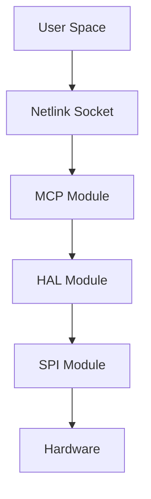
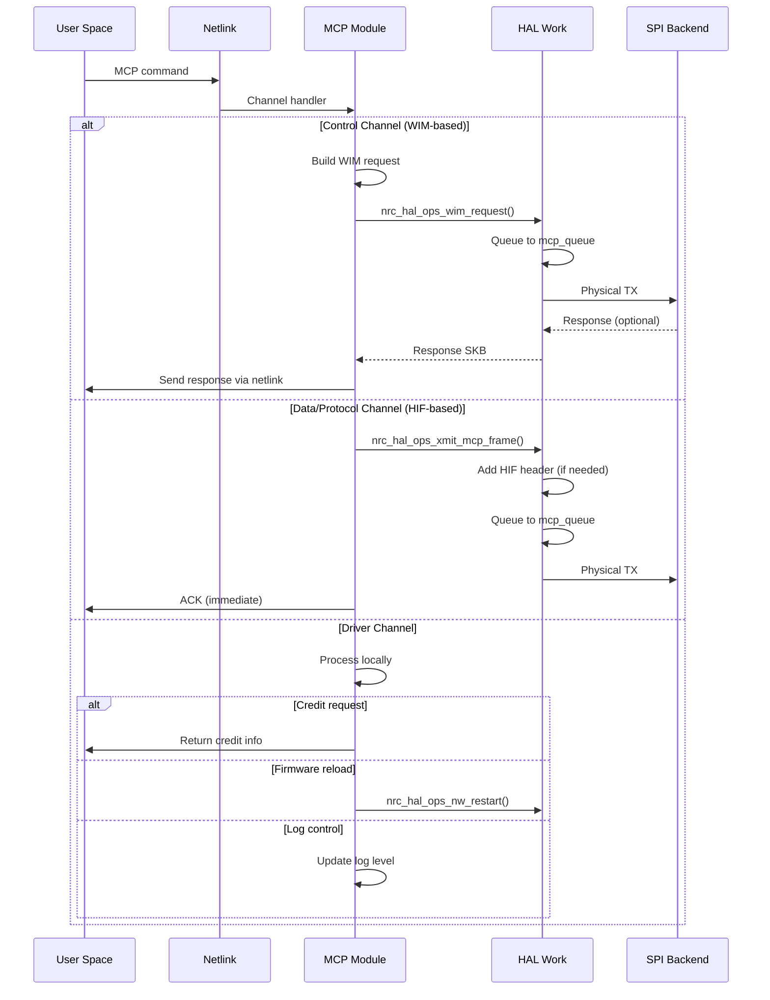
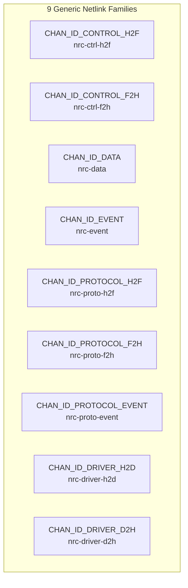
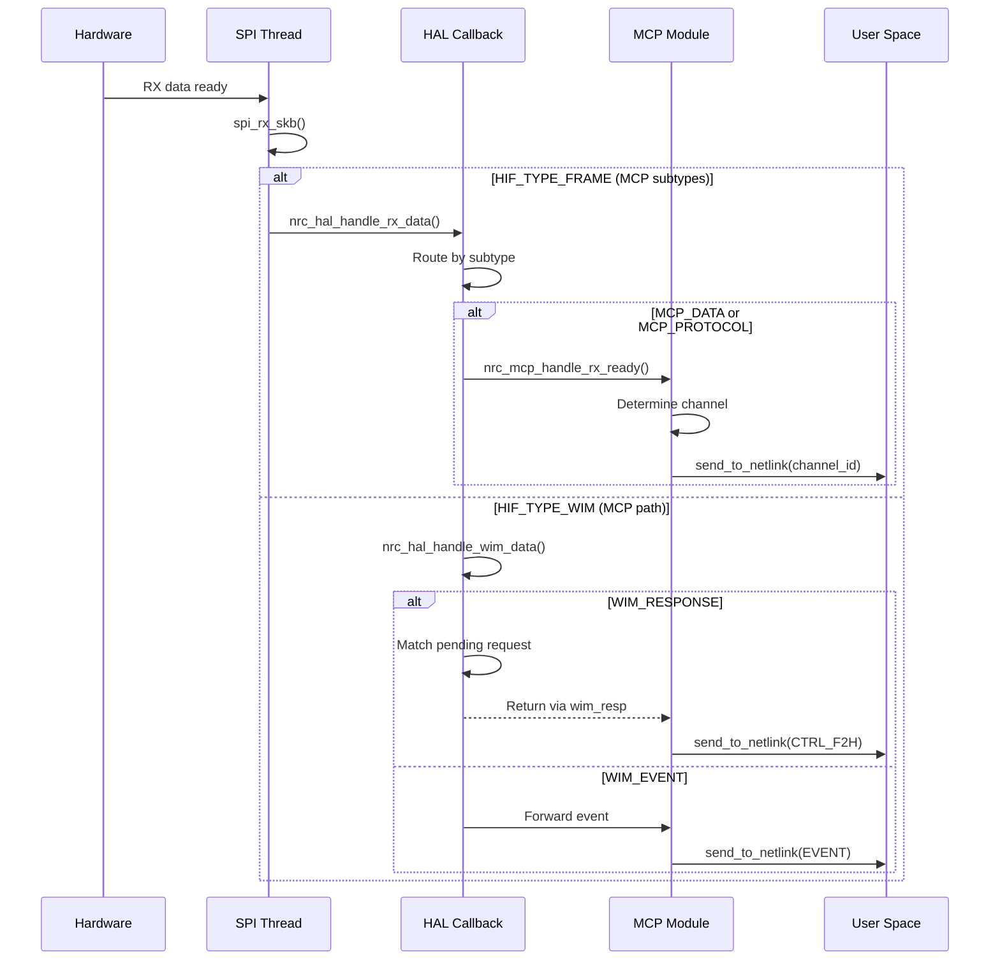

# NRC Modular Driver - MCP Layer

## Overview

The MCP module (`nrc-mcp.ko`) provides a custom protocol interface through Generic Netlink with 9 dedicated channels.

**Module Type**: Frontend  
**Interface**: Generic Netlink (9 channels)  
**Use Case**: Custom protocols, firmware testing, direct hardware control

## TX Data Flow

### TX Path Overview


### Complete TX Sequence


### TX Processing Phases

| Phase | Context | Module | Function | Purpose |
|-------|---------|--------|----------|---------|
| **1. Netlink** | Process | Netlink | Channel handler | Route to processor |
| **2. MCP Processing** | Process | MCP | Build request | Prepare WIM/HIF frame |
| **3. HAL Queueing** | Process | HAL | `nrc_xmit_mcp_frame()` | Add header, enqueue |
| **4. MCP Work** | Workqueue | HAL | `nrc_hif_mcp_work()` | Dequeue, priority control |
| **5. Physical TX** | Workqueue | SPI | `spi_xmit()` | SPI transfer |

### Key TX Functions

#### MCP Layer Functions
```c
// WIM-based transmission (Control channel)
int nrc_mcp_process_wim_request_wait(int req_id, int resp_id, 
                                     u16 wim_cmd, struct wim_tlv *tlv);

// HIF frame-based transmission (Data/Protocol)
int nrc_mcp_xmit_hif_frame(u8 subtype, u8 *data, int len, 
                          bool hif_header_included);
```

#### HAL Interface Functions
```c
// MCP frame transmission with optional HIF header
int nrc_hal_ops_xmit_mcp_frame(u8 subtype, struct sk_buff *skb,
                               bool hif_header_included);

// WIM operations
struct sk_buff *nrc_hal_ops_wim_alloc_skb(u16 cmd, u16 len);
int nrc_hal_ops_wim_skb_add_tlv(struct sk_buff *skb, u16 t, u16 l, void *v);
int nrc_hal_ops_wim_request(struct sk_buff *wim_skb, u16 cmd, u32 timeout,
                            bool use_mcp_path, struct sk_buff **wim_resp);
```

## Netlink Channel Architecture

### Channel Structure


### Channel Details

| Channel | ID | Direction | Protocol | Purpose |
|---------|-----|-----------|----------|---------|
| **CTRL_H2F** | 0 | Host→FW | WIM | Configuration commands |
| **CTRL_F2H** | 1 | FW→Host | WIM | Configuration responses |
| **DATA** | 2 | Bidirectional | HIF | Data packets |
| **EVENT** | 3 | FW→Host | HIF | Firmware events |
| **PROTO_H2F** | 4 | Host→FW | HIF | Protocol messages |
| **PROTO_F2H** | 5 | FW→Host | HIF | Protocol responses |
| **PROTO_EVENT** | 6 | FW→Host | HIF | Protocol events |
| **DRIVER_H2D** | 7 | Host→Driver | Various | Driver control |
| **DRIVER_D2H** | 8 | Driver→Host | Various | Driver status |

### Channel Operations

Each channel has two operations:
```c
enum {
    OPS_INIT = 0,      // User connection init (save portid)
    OPS_REQUEST = 1    // Process actual request
};
```

### Netlink Processing Functions

#### Control Channel (WIM-based)
```c
// Location: nrc-netlink-driver.c
static int process_control_h2f(struct sk_buff *skb, struct genl_info *info)
{
    struct wim_tlv *tlv = nla_data(info->attrs[ATTR_REQUEST]);
    
    return nrc_mcp_process_wim_request_wait(
        CHAN_ID_CONTROL_H2F,
        CHAN_ID_CONTROL_F2H,
        WIM_CMD_MCP_CHAN_ID_CONTROL_H2F,
        tlv
    );
}
```

#### Data Channel (HIF-based)
```c
static int process_data(struct sk_buff *skb, struct genl_info *info)
{
    struct nlattr *attr = info->attrs[ATTR_REQUEST];
    
    // hif_header_included=false: HAL adds HIF header
    return nrc_mcp_xmit_hif_frame(
        HIF_FRAME_SUB_MCP_DATA,
        nla_data(attr),
        nla_len(attr),
        false
    );
}
```

#### Protocol Channel (HIF-based)
```c
static int process_protocol_h2f(struct sk_buff *skb, struct genl_info *info)
{
    struct nlattr *attr = info->attrs[ATTR_REQUEST];
    
    return nrc_mcp_xmit_hif_frame(
        HIF_FRAME_SUB_MCP_PROTOCOL,
        nla_data(attr),
        nla_len(attr),
        false
    );
}
```

#### Driver Channel (Local processing)
```c
static int process_driver_h2d(struct sk_buff *skb, struct genl_info *info)
{
    struct wim_tlv *tlv = nla_data(info->attrs[ATTR_REQUEST]);
    
    switch (tlv->t) {
    case TLV_TYPE_DRIVER_RAW_PACKET:
        // Raw packet with pre-built HIF header
        // hif_header_included=true
        return nrc_mcp_xmit_hif_frame(..., true);
        
    case TLV_TYPE_DRIVER_FIRMWARE:
        // Trigger firmware reload
        return nrc_hal_ops_nw_restart();
        
    case TLV_TYPE_DRIVER_SET_LOG:
        // Update log level
        return nrc_logger_set(name, level);
        
    case TLV_TYPE_DRIVER_REQ_CREDIT:
        // Return credit information
        return send_to_netlink(CHAN_ID_DRIVER_D2H, reply);
    }
}
```

## RX Data Flow

### RX Path Overview


### RX Processing


### Key RX Functions

```c
// MCP RX callback (registered with HAL)
void nrc_mcp_handle_rx_ready(void *priv, struct sk_buff *skb);

// Netlink response sender
int send_to_netlink(int channel_id, struct sk_buff *skb);
```

## Transmission Methods

### WIM-based Transmission (Control Channel)

**Use Case**: Configuration commands requiring firmware acknowledgment

**Flow**:
```c
// 1. Allocate WIM SKB
wim_skb = nrc_hal_ops_wim_alloc_skb(cmd, len);

// 2. Add TLV
nrc_hal_ops_wim_skb_add_tlv(wim_skb, tlv->t, tlv->l, tlv->v);

// 3. Send with response wait
ret = nrc_hal_ops_wim_request(wim_skb, 0, WIM_RESP_TIMEOUT,
                               use_mcp_path=true, &wim_resp);

// 4. Process response
if (wim_resp) {
    send_to_netlink(CHAN_ID_CONTROL_F2H, wim_resp);
}
```

**Timeout**: 3000ms (WIM_RESP_TIMEOUT)

### HIF Frame-based Transmission (Data/Protocol)

**Use Case**: Fire-and-forget data/protocol messages

**Flow**:
```c
// 1. Allocate SKB (data only)
skb = dev_alloc_skb(len);
skb_put_data(skb, data, len);

// 2. Transmit with conditional HIF header
ret = nrc_hal_ops_xmit_mcp_frame(subtype, skb, hif_header_included);

// In HAL (nrc_xmit_mcp_frame):
if (!hif_header_included) {
    // Prepend HIF header
    skb_push(skb, sizeof(struct hif));
    hif->type = HIF_TYPE_FRAME;
    hif->subtype = subtype;  // MCP_DATA or MCP_PROTOCOL
}

// 3. Queue to mcp_queue
nrc_hif_enqueue_mcp_skb(skb);

// 4. Schedule MCP work
queue_work(mcp_workqueue, &hdev->mcp_work);
```

**HIF Header Modes**:
- `hif_header_included=false`: HAL adds header (normal data/protocol)
- `hif_header_included=true`: Pre-built header (raw packets from driver channel)

## MCP Priority Control

### Priority Feature

**Parameter**: `mcp_priority` (module parameter)
- `0`: Parallel TX (default) - WLAN and MCP transmit simultaneously
- `1`: MCP priority - Suspend WLAN TX during MCP transmission

### Implementation

```c
// In nrc_hif_mcp_work()
if (hdev->params->mcp_priority) {
    atomic_set(&hdev->mcp_active, 1);
}

// Process MCP queue
while (!skb_queue_empty(&hdev->mcp_queue[i])) {
    // ... transmit ...
}

if (hdev->params->mcp_priority && skb_queue_empty_all) {
    atomic_set(&hdev->mcp_active, 0);
    // Resume WLAN TX
    queue_work(wlan_workqueue, &hdev->work);
}
```

```c
// In nrc_hif_wlan_work()
if (hdev->params->mcp_priority && atomic_read(&hdev->mcp_active)) {
    // Suspend WLAN TX, reschedule later
    queue_delayed_work(wlan_workqueue, &hdev->work, delay);
    return;
}
```

### Usage
```bash
# Enable priority
insmod nrc-mcp.ko mcp_priority=1

# Default (parallel)
insmod nrc-mcp.ko
```

## Power Save Integration

### TX Power Save Check
```c
// In nrc_hif_mcp_work()
if (NRC_DRV_IS_ASLEEP(hdev)) {
    // Re-queue frame
    nrc_hif_enqueue_mcp_skb(skb);
    
    // Trigger wakeup
    nrc_hal_trigger_ps_event(NRC_PS_REASON_HAL_TX_WAKEUP);
    
    return;
}
```

## Key Data Structures

### MCP Context
```c
struct nrc_mcp_priv {
    struct nrc_hif_device *hif;
    
    // Netlink state
    struct {
        u32 portid;  // User space port ID
    } user_info[CHAN_ID_MAX];
    
    // Callbacks
    struct nrc_mcp_callback callbacks;
};
```

### HAL MCP Support
```c
struct nrc_hif_device {
    // MCP queues (priority 0 and 1)
    struct sk_buff_head mcp_queue[2];
    
    // MCP workqueue
    struct work_struct mcp_work;
    struct workqueue_struct *mcp_workqueue;
    
    // Priority control
    atomic_t mcp_active;
};
```

## Netlink Channel Initialization

### Initialization Process
```c
// netlink_driver_init()
for (id = 0; id < CHAN_ID_MAX; id++) {
    init_family(id);
}

// init_family() for each channel
static int init_family(int id)
{
    // Configure genl_family
    nrc_family[id].name = channel_names[id];
    nrc_family[id].ops = nrc_genl_ops[id];
    nrc_family[id].n_ops = 2;  // OPS_INIT, OPS_REQUEST
    
    // Register with kernel
    return genl_register_family(&nrc_family[id]);
}
```

### OPS_INIT Handler (Connection Setup)
```c
static int process_control_h2f_init(struct sk_buff *skb, 
                                   struct genl_info *info)
{
    // Save user portid for response routing
    user_info[CHAN_ID_CONTROL_H2F].portid = info->snd_portid;
    return 0;
}
```

### OPS_REQUEST Handler (Command Processing)
```c
static int process_control_h2f(struct sk_buff *skb,
                               struct genl_info *info)
{
    // Process actual command
    // ...
}
```

## Response Mechanism

### send_to_netlink() Flow
```c
int send_to_netlink(int id, struct sk_buff *skb)
{
    // 1. Validate channel and connection
    if (!user_info[id].portid)
        return -EINVAL;
    
    // 2. Allocate netlink response
    reply_skb = genlmsg_new(NLMSG_GOODSIZE, GFP_KERNEL);
    
    // 3. Build message
    msg_head = genlmsg_put(reply_skb, 0, 0, &nrc_family[id], 
                          0, ATTR_RESPONSE);
    
    // 4. Add data
    nla_put(reply_skb, ATTR_REQUEST, skb->len, skb->data);
    
    // 5. Send to user space
    genlmsg_unicast(&init_net, reply_skb, user_info[id].portid);
    
    return 0;
}
```

## MCP vs WLAN Comparison

| Aspect | MCP Module | WLAN Module |
|--------|------------|-------------|
| **Frontend Type** | NRC_FRONTEND_MCP | NRC_FRONTEND_WLAN |
| **Interface** | Generic Netlink (9 channels) | IEEE 802.11 (mac80211) |
| **Protocol** | Custom (WIM + HIF frames) | IEEE 802.11 |
| **TX Context** | Process (netlink) | Tasklet (mac80211) |
| **Credit System** | No credits | Per-AC credits |
| **Priority Control** | Optional (mcp_priority) | Always parallel |
| **Use Case** | Testing, custom protocols | Standard Wi-Fi |

## Configuration Parameters

### Module Parameters
- **mcp_priority**: Enable MCP priority (0=parallel, 1=priority)

### Netlink Attributes
- **ATTR_REQUEST**: Command/data payload
- **ATTR_RESPONSE**: Response data

## Usage Example

### User Space Command
```python
#!/usr/bin/env python3
from pyroute2 import GenericNetlinkSocket

# Connect to control channel
nl = GenericNetlinkSocket()
nl.bind("nrc-ctrl-h2f", process_control_h2f_init)

# Send WIM command
nl.nlm_request({"cmd": OPS_REQUEST, "attrs": [("ATTR_REQUEST", wim_tlv)]})

# Receive response on F2H channel
response = nl.get()
```

## Related Documents

- [Architecture Overview](dev-overview-architecture.md)
- [WLAN Layer](dev-layer-wlan.md)
- [HAL Layer](dev-layer-hal.md)
- [SPI Layer](dev-layer-spi.md)
