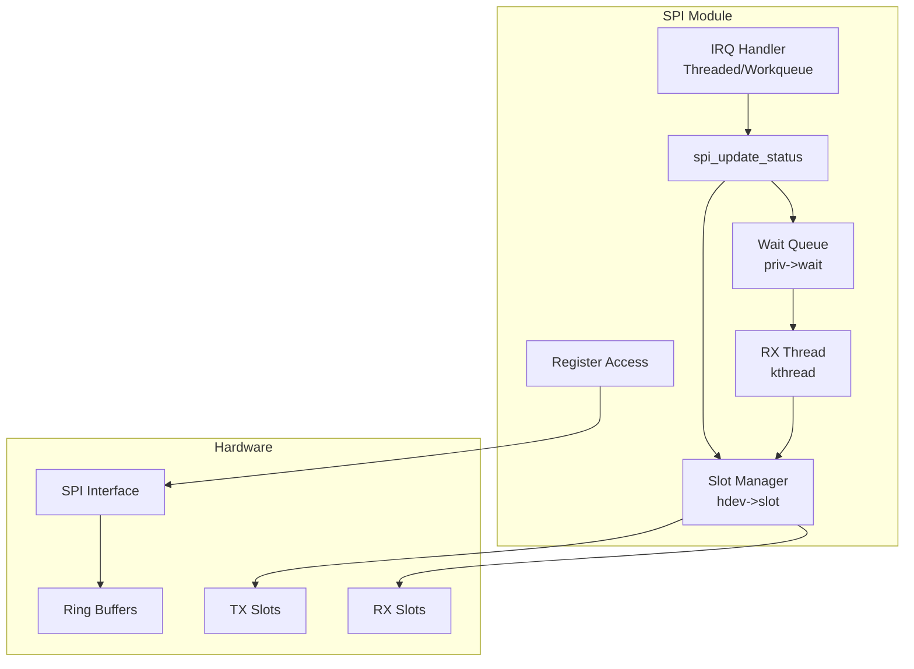
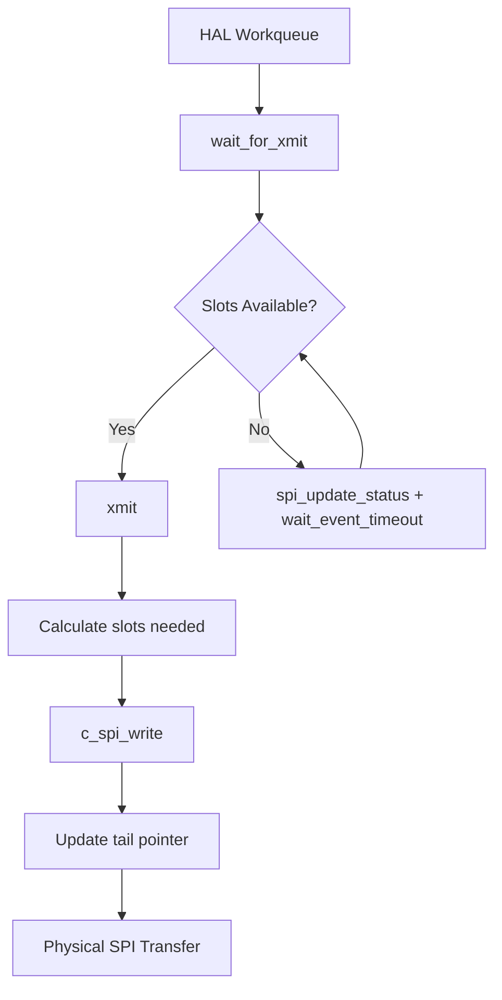
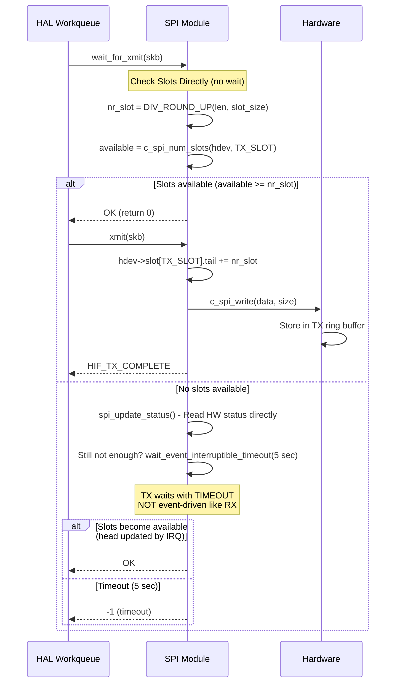
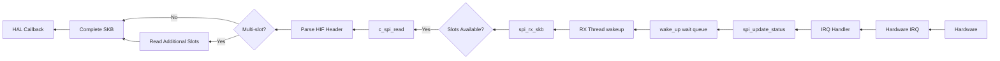
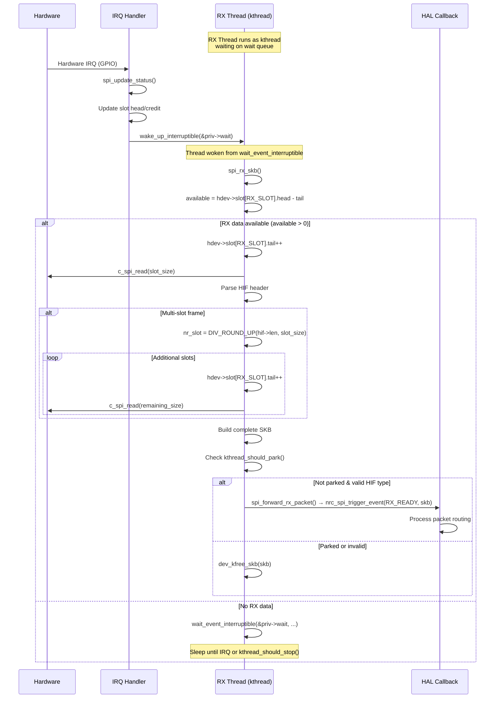
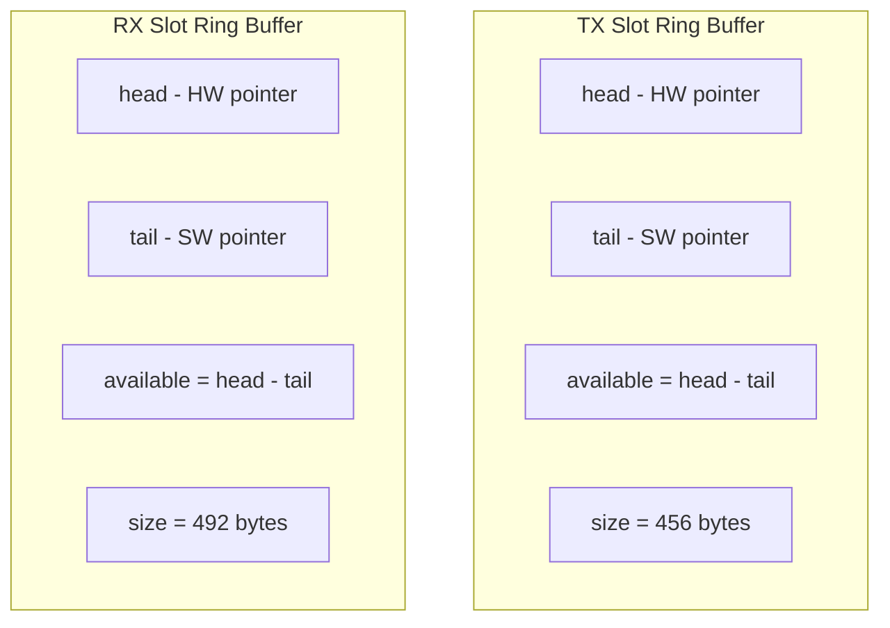
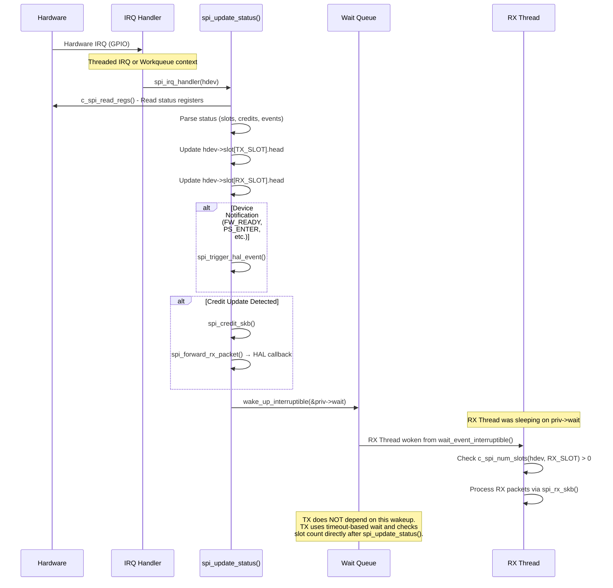
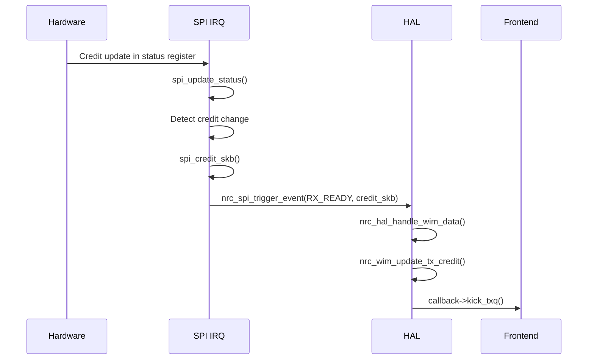

# NRC Modular Driver - SPI Layer

## Overview

The SPI module (`nrc_spi.ko`) provides physical communication with hardware through SPI interface and manages hardware slot buffers.

**Module Type**: Backend  
**Purpose**: Physical SPI communication, slot management, IRQ handling  
**Interface**: Linux SPI subsystem, Hardware registers

## Architecture



### Key Design Points

1. **RX Thread is NOT an IRQ handler** - It's a kernel thread (kthread) that waits on `priv->wait` queue
2. **TX does NOT use wait queue primarily** - TX checks slot count directly, uses `wait_event_interruptible_timeout()` only when slots are insufficient
3. **Shared Wait Queue** - Both TX (when waiting) and RX use `priv->wait`, but TX timeout-based, RX event-driven
4. **Slot Data Location** - Slot head/tail/size/count stored in `hdev->slot[]`, not `priv->slot[]`
5. **IRQ Role** - Updates status registers (slot heads, credits) and wakes `priv->wait` queue

## TX Data Flow

### SPI TX Overview


### Complete TX Sequence


### TX Processing Functions

#### Slot Wait
```c
// Wait for TX slots availability (timeout-based, NOT IRQ-driven)
int spi_wait_for_xmit(struct nrc_hif_device *hdev, struct sk_buff *skb);

// Implementation - Direct slot check first, then wait with timeout
int nr_slot = DIV_ROUND_UP(skb->len, hdev->slot[TX_SLOT].size);

// Fast path: slots already available
if (c_spi_num_slots(hdev, TX_SLOT) >= nr_slot)
    return 0;

// Slow path: read status directly, then wait with timeout
spi_update_status(hdev);  // Direct SPI read, NOT waiting for IRQ

ret = wait_event_interruptible_timeout(priv->wait,
    (c_spi_num_slots(hdev, TX_SLOT) >= nr_slot) || kthread_should_stop(),
    5 * HZ);  // 5 second timeout

if (ret == 0)  // Timeout
    return -1;
return 0;
```

#### Physical Transmission
```c
// Transmit SKB via SPI
int spi_xmit(struct nrc_hif_device *hdev, struct sk_buff *skb);

// Core write operation
ssize_t c_spi_write(struct spi_device *spi, u8 *buf, ssize_t size);
```

#### Slot Update
```c
// Get available slots
static inline int c_spi_num_slots(struct nrc_spi_priv *priv, int dir)
{
    return (priv->slot[dir].head - priv->slot[dir].tail);
}

// Update tail after TX
priv->slot[TX_SLOT].tail += nr_slot;
```

## RX Data Flow

### SPI RX Overview


### Complete RX Sequence


### RX Processing Functions

#### Main RX Thread
```c
// RX kthread - continuous packet polling (NOT IRQ context)
int spi_rx_thread(void *data);

// Thread sleeps on shared wait queue (TX/RX common)
// Woken by IRQ handler via wake_up_interruptible(&priv->wait)
wait_event_interruptible(priv->wait, 
    (c_spi_num_slots(hdev, RX_SLOT) > 0) ||
    kthread_should_stop() || kthread_should_park());
```

#### Single Packet Read
```c
// Read single HIF packet
struct sk_buff *spi_rx_skb(struct spi_device *spi,
                           struct nrc_spi_priv *priv,
                           struct nrc_hif_device *hdev);

// Implementation (slot data stored in hdev, not priv)
int available = c_spi_num_slots(hdev, RX_SLOT);
if (available <= 0)
    return NULL;

// Read first slot
hdev->slot[RX_SLOT].tail++;
c_spi_read(spi, skb->data, hdev->slot[RX_SLOT].size);

// Parse HIF header
struct hif *hifh = (struct hif *)skb->data;
int nr_slot = DIV_ROUND_UP(hifh->len + sizeof(*hifh), hdev->slot[RX_SLOT].size);

// Read additional slots if needed
if (nr_slot > 1) {
    hdev->slot[RX_SLOT].tail += (nr_slot - 1);
    c_spi_read(spi, skb->data + hdev->slot[RX_SLOT].size, second_length);
}

return skb;
```

#### Physical Read
```c
// Core read operation
int c_spi_read(struct nrc_spi_priv *priv, u8 *data, size_t len);
```

## Slot Management

### Slot Structure
```c
struct nrc_spi_priv {
    struct {
        u16 head;   // Hardware pointer (from status register)
        u16 tail;   // Software pointer (updated by driver)
        u16 size;   // Slot size (TX: 456, RX: 492 bytes)
        u16 count;  // Available slot count (from status register)
    } slot[2];      // slot[0]: TX_SLOT, slot[1]: RX_SLOT
};

#define TX_SLOT 0
#define RX_SLOT 1
```

### Slot Sizes
| Direction | Slot Size | Purpose |
|-----------|-----------|---------|
| **TX** | 456 bytes | Host → Firmware |
| **RX** | 492 bytes | Firmware → Host |

### Slot Ring Buffer


### Slot Availability Check
```c
// TX: Check if enough slots for transmission
int nr_slot = DIV_ROUND_UP(len, priv->slot[TX_SLOT].size);
int available = priv->slot[TX_SLOT].head - priv->slot[TX_SLOT].tail;

if (available < nr_slot) {
    // Wait for more slots
    wait_event_timeout(...);
}

// RX: Check if data available
int available = priv->slot[RX_SLOT].head - priv->slot[RX_SLOT].tail;

if (available > 0) {
    // Read RX data
}
```

### Multi-slot Frames
```c
// Calculate slots needed
int nr_slot = DIV_ROUND_UP(total_len, slot_size);

// Example: 2000 byte frame with 456 byte TX slots
// nr_slot = DIV_ROUND_UP(2000, 456) = 5 slots

// TX: Consume 5 slots (slot data in hdev, not priv)
hdev->slot[TX_SLOT].tail += 5;

// RX: Consume 5 slots
hdev->slot[RX_SLOT].tail += 5;
```

## IRQ Handling

### IRQ Architecture

```
┌─────────────────────────────────────────────────────────────────────────────┐
│                             IRQ Processing Flow                              │
├─────────────────────────────────────────────────────────────────────────────┤
│                                                                              │
│  ┌──────────────┐     ┌─────────────────────┐     ┌──────────────────────┐ │
│  │ Hardware IRQ │────>│ IRQ Handler         │────>│ spi_update_status()  │ │
│  │ (GPIO)       │     │ (Threaded/Workqueue)│     │                      │ │
│  └──────────────┘     └─────────────────────┘     └──────────┬───────────┘ │
│                                                               │             │
│                                                               v             │
│                              ┌────────────────────────────────────────────┐│
│                              │ Process status register:                   ││
│                              │ - Update hdev->slot[TX_SLOT].head          ││
│                              │ - Update hdev->slot[RX_SLOT].head          ││
│                              │ - Update credit rear[]                     ││
│                              │ - Handle device notifications              ││
│                              └────────────────────────────────┬───────────┘│
│                                                               │             │
│                                                               v             │
│                              ┌────────────────────────────────────────────┐│
│                              │ wake_up_interruptible(&priv->wait)         ││
│                              └────────────────────────────────┬───────────┘│
│                                                               │             │
│                                                               v             │
│                              ┌────────────────────────────────────────────┐│
│                              │ RX Thread wakes up                         ││
│                              │ (was waiting on priv->wait)                ││
│                              └───────────────────────────────────────────-┘│
│                                                                              │
│  Note: TX does NOT wait on IRQ. TX checks slot count directly and uses     │
│        wait_event_interruptible_timeout() only when slots insufficient.    │
│        IRQ updating slot head allows TX condition to become true.          │
│                                                                              │
└─────────────────────────────────────────────────────────────────────────────┘
```

### IRQ Handler Modes

The SPI module supports two IRQ handling modes based on kernel configuration:

```c
#ifdef CONFIG_SUPPORT_THREADED_IRQ
// Threaded IRQ handler - runs in thread context (preferred)
irqreturn_t spi_irq(int irq, void *data);
#else
// Hard IRQ handler - queues work for processing
static irqreturn_t spi_irq(int irq, void *data);
// Work processed in workqueue via irq_worker()
static void irq_worker(struct work_struct *work);
#endif
```

### IRQ Flow


### Status Register Update
```c
// Update status from hardware
int spi_update_status(struct nrc_hif_device *hdev);

// Read status registers
struct spi_status_reg *status = &priv->hw.status;
c_spi_read_regs(spi, C_SPI_EIRQ_MODE, (void *)status, sizeof(*status));

// Parse TX/RX slot heads (stored in hdev, not priv)
hdev->slot[RX_SLOT].head = __be32_to_cpu(status->msg[0]) & 0xffff;
hdev->slot[TX_SLOT].head = __be32_to_cpu(status->msg[0]) >> 16;

// Parse slot counts
hdev->slot[TX_SLOT].count = status->rxq_status[1] & RXQ_SLOT_COUNT;
hdev->slot[RX_SLOT].count = status->txq_status[1] & TXQ_SLOT_COUNT;

// Wake up RX thread (TX uses timeout-based polling)
wake_up_interruptible(&priv->wait);
```

### Event Processing
```c
// Generate credit event SKB
if (credit_update_detected) {
    struct sk_buff *skb = spi_credit_skb(priv);
    nrc_spi_trigger_event(NRC_SPI_RX_READY, skb);
}
```

## Register Access

### SPI Register Operations
```c
// Read single register
u32 c_spi_read_reg(struct nrc_spi_priv *priv, u32 addr);

// Write single register
void c_spi_write_reg(struct nrc_spi_priv *priv, u32 addr, u32 value);

// Read multiple registers
void c_spi_read_regs(struct nrc_spi_priv *priv, u32 addr, 
                     u32 *buf, int count);

// Write multiple registers
void c_spi_write_regs(struct nrc_spi_priv *priv, u32 addr,
                      u32 *buf, int count);
```

### Key Registers
| Register | Purpose |
|----------|---------|
| **C_SPI_RXQ_STATUS** | RX queue head/count |
| **C_SPI_TXQ_STATUS** | TX queue head/count |
| **C_SPI_EIRQ_MODE** | IRQ mode configuration |
| **C_SPI_EIRQ_ENABLE** | IRQ enable/disable |
| **C_SPI_EIRQ_STATUS** | IRQ status flags |

## Credit Event Generation

### Credit SKB Creation
```c
// Generate credit update SKB
struct sk_buff *spi_credit_skb(struct nrc_spi_priv *priv);

// SKB format: HIF + WIM + Credit TLVs
struct hif *hif;
struct wim *wim;
struct wim_tlv *tlv;

skb = dev_alloc_skb(sizeof(*hif) + sizeof(*wim) + tlv_size);

hif = (struct hif *)skb->data;
hif->type = HIF_TYPE_WIM;
hif->subtype = HIF_WIM_SUB_EVENT;

wim = (struct wim *)(hif + 1);
wim->cmd = WIM_EVENT_CREDIT_REPORT;

// Add credit TLVs for each AC
```

### Credit Flow


## Power Save Support

### Suspend
```c
// Suspend SPI operations
int spi_rx_thread_suspend(struct nrc_hif_device *hdev);

// Park RX thread (NOT stop) for deep sleep
kthread_park(priv->kthread);
atomic_set(&priv->rx_thread_parked, 1);

// Synchronize IRQ (IRQ is NOT disabled, only synchronized)
synchronize_irq(spi->irq);
```

### Resume
```c
// Resume SPI operations
int spi_rx_thread_resume(struct nrc_hif_device *hdev);

// Unpark RX thread (thread continues from where it was parked)
kthread_unpark(priv->kthread);
atomic_set(&priv->rx_thread_parked, 0);
```

## Key Data Structures

### SPI Private Data
```c
struct nrc_spi_priv {
    struct spi_device *spi;
    struct nrc_hif_device *hdev;  // Reference to HAL's hif_device
    
    // Hardware info cache
    struct {
        struct spi_sys_reg sys;       // System registers
        struct spi_status_reg status; // Status registers
    } hw;
    
    // RX thread (kthread, not IRQ)
    struct task_struct *kthread;      // rx_thread renamed to kthread
    atomic_t rx_thread_parked;        // Park state tracking
    
    // Shared wait queue for TX and RX
    wait_queue_head_t wait;           // Single queue for TX waiters and RX thread
    
    // Polling mode (alternative to IRQ)
    struct task_struct *polling_kthread;
    int polling_interval;
    
    // IRQ workqueue (non-threaded IRQ mode)
#if !defined(CONFIG_SUPPORT_THREADED_IRQ)
    struct workqueue_struct *irq_wq;
    struct work_struct irq_work;
#endif
    
    // IRQ request tracking
    bool irq_requested;
    
    // Slot synchronization
    struct mutex slot_sync_lock;
    bool slot_sync_lock_initialized;
    bool slot_sync_auto;              // HW auto sync capability
    
    // Power save GPIO tracking
    bool power_save_gpio_allocated;
    int power_save_gpio_number;
    
    // Loopback test
    struct delayed_work work;
    unsigned long loopback_total_cnt;
    // ... other loopback fields
};

// Note: Slot data is stored in hdev->slot[], not in priv
// struct nrc_hif_device contains:
//   struct {
//       u16 head;   // HW pointer (updated by spi_update_status)
//       u16 tail;   // SW pointer (updated by driver)
//       u16 size;   // TX: 456, RX: 492 bytes
//       u16 count;  // Available slot count
//   } slot[2];      // slot[0]: TX_SLOT, slot[1]: RX_SLOT
```

### SPI HIF Operations
```c
struct nrc_hif_ops {
    // Device management
    int (*probe)(struct nrc_hif_device *hdev);
    int (*start)(struct nrc_hif_device *hdev);
    int (*stop)(struct nrc_hif_device *hdev);
    
    // TX operations
    int (*wait_for_xmit)(struct nrc_hif_device *hdev, struct sk_buff *skb);
    int (*xmit)(struct nrc_hif_device *hdev, struct sk_buff *skb);
    int (*write)(struct nrc_hif_device *hdev, const u8 *data, const u32 len);
    int (*read)(struct nrc_hif_device *hdev, const u8 *data, const u32 len);
    int (*wait_rxq_slot)(struct nrc_hif_device *hdev, u8 *data, u32 len);
    
    // RX thread control (for power save)
    int (*rx_thread_suspend)(struct nrc_hif_device *hdev);
    int (*rx_thread_resume)(struct nrc_hif_device *hdev);
    
    // Device control
    void (*reset_device)(struct nrc_hif_device *hdev);
    int (*test)(struct nrc_hif_device *hdev);
    int (*update)(struct nrc_hif_device *hdev);
    int (*check_target)(struct nrc_hif_device *hdev, u8 reg);
    
    // Power save
    int (*ps_status)(struct nrc_hif_device *hdev);
    
    // GPIO operations
    int (*gpio_alloc)(struct nrc_hif_device *hdev, int gpio_num, const char *label);
    void (*gpio_free)(struct nrc_hif_device *hdev, int gpio_num);
    void (*gpio_set)(struct nrc_hif_device *hdev, int gpio_num, int value);
    
    // Firmware state
    bool (*fw_is_boot)(struct nrc_hif_device *hdev);   // Check if in bootloader mode
    bool (*fw_is_loaded)(struct nrc_hif_device *hdev); // Check if FW loaded (SW_ID)
    enum NRC_FW_STATE (*fw_state)(struct nrc_hif_device *hdev);
};
```

**Note**: Slot and credit initialization is handled by `nrc_hif_reset_slot_credit()` in HAL core module, not by backend.

## Error Handling

### TX Timeout
```c
// In spi_wait_for_xmit()
ret = wait_event_interruptible_timeout(priv->wait,
    (c_spi_num_slots(hdev, TX_SLOT) >= nr_slot) || kthread_should_stop(),
    5 * HZ);
if (ret == 0) {
    DBG_HIF("spi xmit timeout");
    return -1;
}
```

### Slot Overflow Detection
```c
// Validate slot calculation
int nr_slot = DIV_ROUND_UP(len, hdev->slot[TX_SLOT].size);
if (nr_slot > hdev->slot[TX_SLOT].count) {
    ERR_SPI("Frame too large: %d slots needed, %d available",
            nr_slot, hdev->slot[TX_SLOT].count);
    return -ENOMEM;
}
```

### RX Error Recovery
```c
// In spi_rx_skb()
if (kthread_should_stop() || kthread_should_park()) {
    goto fail;
}

// Invalid HIF header check
if (hif->type >= HIF_TYPE_MAX || hif->len == 0) {
    spi_reset_rx(hdev);
    goto fail;
}
```

## Performance Optimization

### Burst Transfers
```c
// Read/write multiple slots in single SPI transaction
int total_size = nr_slot * slot_size;
c_spi_write(priv, data, total_size);
```

### IRQ Coalescing
- Hardware may batch multiple events into single IRQ
- Driver processes all pending RX packets in RX thread
- Credit updates bundled with other status updates

### Wait Queue Optimization
```c
// TX: Wait only when necessary
if (available >= nr_slot) {
    // Proceed immediately
} else {
    // Wait with timeout
    wait_event_timeout(...);
}

// RX: Sleep when no data
wait_event_interruptible(priv->wait_rx, 
                        condition || kthread_should_stop());
```

## Module Parameters

### SPI Module Parameters
- **spi_clock_speed**: SPI clock frequency (Hz)
- **spi_mode**: SPI mode (0-3)
- **use_dma**: Enable DMA for SPI transfers

## Debugging

### Debug Flags
```c
// SPI-specific debug
#define NRC_DBG_SPI     BIT(5)
#define NRC_DBG_HIF     BIT(6)

// Usage
nrc_dbg(NRC_DBG_SPI, "TX: %d slots, %d bytes", nr_slot, len);
```

### Slot Status Dump
```c
// Dump current slot status
nrc_dbg(NRC_DBG_HIF, "TX: head=%d tail=%d available=%d",
        priv->slot[TX_SLOT].head,
        priv->slot[TX_SLOT].tail,
        c_spi_num_slots(priv, TX_SLOT));
```

## Related Documents

- [Architecture Overview](dev-overview-architecture.md)
- [Module System](dev-module-system.md)
- [WLAN Layer](dev-layer-wlan.md)
- [MCP Layer](dev-layer-mcp.md)
- [HAL Layer](dev-layer-hal.md)
- [Power Management](dev-power-management.md)
