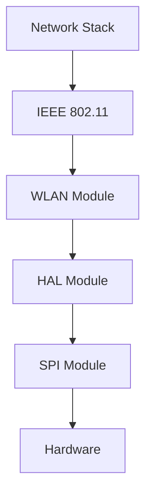
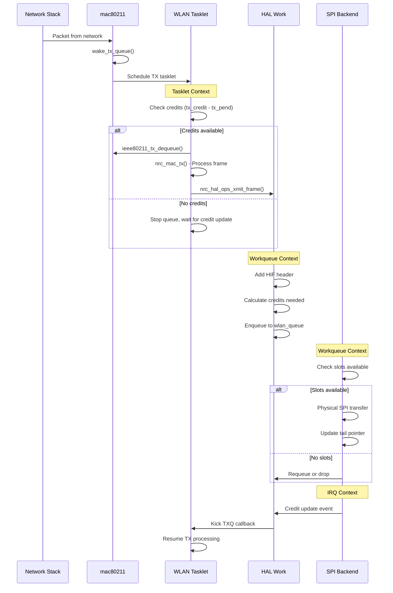
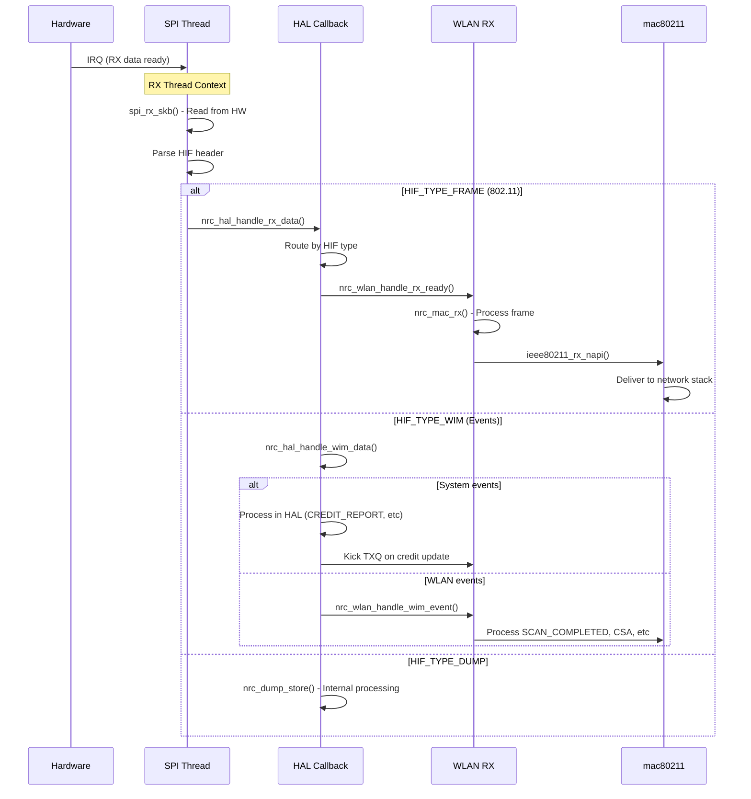
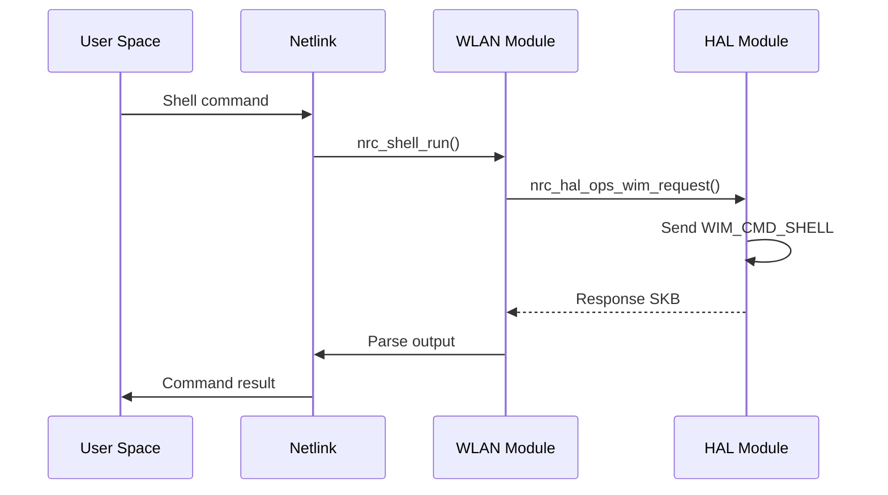
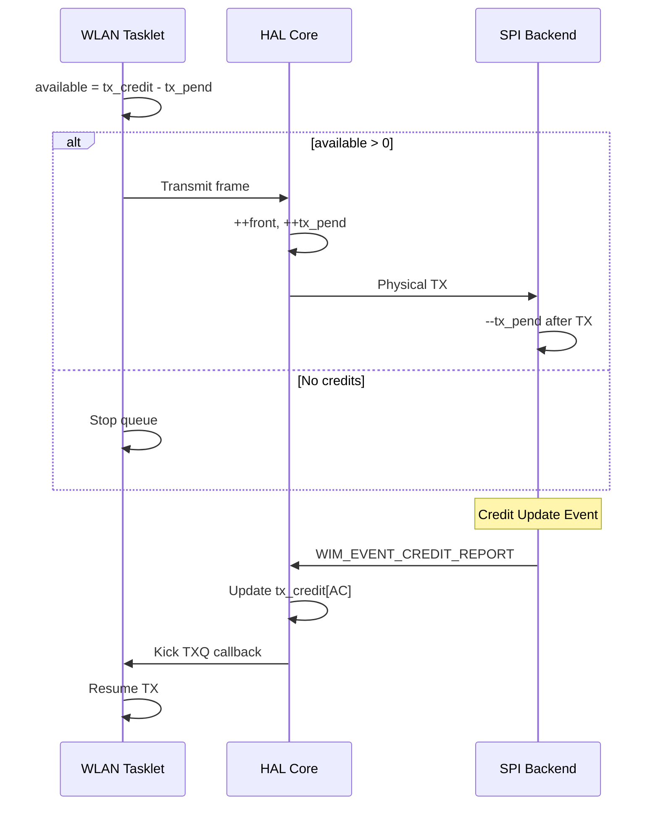

# NRC Modular Driver - WLAN Layer

## Overview

The WLAN module (`nrc_wlan.ko`) provides standard IEEE 802.11 Wi-Fi functionality through Linux mac80211/cfg80211 framework.

**Module Type**: Frontend  
**Interface**: IEEE 802.11 (mac80211/cfg80211)  
**Use Case**: Standard Wi-Fi connectivity (STA, AP, P2P)

## TX Data Flow

### TX Path Overview


### Complete TX Sequence


### TX Processing Phases

| Phase | Context | Module | Function | Purpose |
|-------|---------|--------|----------|---------|
| **1. Initiation** | Process | mac80211 | `wake_tx_queue()` | Frame arrival |
| **2. Scheduling** | Process | WLAN | `nrc_kick_txq()` | Schedule tasklet |
| **3. Frame Processing** | Tasklet | WLAN | `nrc_tx_tasklet()` | Credit check, dequeue |
| **4. MAC Processing** | Tasklet | WLAN | `nrc_mac_tx()` | IEEE 802.11 processing |
| **5. HAL Queueing** | Tasklet | HAL | `nrc_xmit_frame()` | HIF header, enqueue |
| **6. Physical TX** | Workqueue | SPI | `spi_xmit()` | SPI transfer |

### Key TX Functions

#### WLAN Layer Functions
```c
// Frame entry point from mac80211
void nrc_wake_tx_queue(struct ieee80211_hw *hw, struct ieee80211_txq *txq);

// Tasklet scheduling
void nrc_kick_txq(struct nrc *nw);

// Main TX tasklet
void nrc_tx_tasklet(unsigned long data);

// MAC frame processing
int nrc_mac_tx(struct nrc *nw, struct sk_buff *skb);
```

#### HAL Interface Functions
```c
// Inline wrappers in nrc-hal-core-interface.h
static inline int nrc_hal_ops_xmit_frame(struct sk_buff *skb);
static inline int nrc_hal_ops_wim_request(struct sk_buff *wim_skb, u16 cmd,
                                          u32 timeout, bool use_mcp_path,
                                          struct sk_buff **wim_resp);
```

## RX Data Flow

### RX Path Overview


### Complete RX Sequence


### RX Processing Phases

| Phase | Context | Module | Function | Purpose |
|-------|---------|--------|----------|---------|
| **1. HW Read** | kthread | SPI | `spi_rx_skb()` | Read from hardware |
| **2. Routing** | kthread | HAL | `nrc_hal_handle_rx_data()` | Route by HIF type |
| **3. Frame Processing** | kthread | WLAN | `nrc_mac_rx()` | IEEE 802.11 processing |
| **4. Stack Delivery** | kthread | mac80211 | `ieee80211_rx_napi()` | Deliver to network |

### Key RX Functions

#### SPI Layer Functions
```c
// Main RX thread
int spi_rx_thread(void *data);

// Read single packet
struct sk_buff *spi_rx_skb(struct nrc_spi_priv *priv);
```

#### HAL Layer Functions
```c
// Main RX routing
void nrc_hal_handle_rx_data(struct nrc_hif_device *hdev, struct sk_buff *skb);

// WIM event processing
void nrc_hal_handle_wim_data(struct nrc_hif_device *hdev, struct sk_buff *skb);
```

#### WLAN Layer Functions
```c
// RX callback from HAL
void nrc_wlan_handle_rx_ready(void *priv, struct sk_buff *skb);

// Main RX processing
void nrc_mac_rx(struct nrc *nw, struct sk_buff *skb);
```

## Netlink Interface

WLAN module also provides netlink interface for management and testing.

### Netlink Commands

| Command | Function | Purpose |
|---------|----------|---------|
| **NL_SHELL_RUN_CMD** | Execute firmware shell command | Debug, configuration |
| **NL_FRAME_INJECTION** | Inject raw 802.11 frame | Testing |
| **NL_MGMT_FRAME_INJECTION** | Inject management frame | Testing |
| **NL_WFA_CAPI_***  | WiFi Alliance certification | Testing |

### Shell Command Flow


### Key Netlink Functions

```c
// Shell commands
int nrc_shell_run(struct sk_buff *skb, struct genl_info *info);
int nrc_shell_run_simple(struct sk_buff *skb, struct genl_info *info);

// Frame injection
int nrc_inject_frame(struct sk_buff *skb, struct genl_info *info);
int nrc_inject_mgmt_frame(struct sk_buff *skb, struct genl_info *info);

// WFA CAPI
int capi_sta_set_11n(struct sk_buff *skb, struct genl_info *info);
int capi_sta_send_addba(struct sk_buff *skb, struct genl_info *info);
```

## Credit Management

### Credit Structure
```c
struct nrc {
    atomic_t tx_credit[IEEE80211_NUM_ACS];  // Available credits per AC
    atomic_t tx_pend[IEEE80211_NUM_ACS];    // Pending frames per AC
    u32 front[IEEE80211_NUM_ACS];           // Sent counter
    u32 rear[IEEE80211_NUM_ACS];            // Completed counter
    u32 credit_max[IEEE80211_NUM_ACS];      // Max credit per AC
};
```

### Credit Flow


### Credit Update Process
1. **TX Start**: Check `tx_credit[AC] - tx_pend[AC]`
2. **TX Enqueue**: Increment `front[AC]` and `tx_pend[AC]`
3. **TX Complete**: Decrement `tx_pend[AC]`
4. **Credit Event**: Firmware sends `WIM_EVENT_CREDIT_REPORT`
5. **Credit Update**: HAL updates `tx_credit[AC]`
6. **Resume TX**: HAL kicks WLAN TXQ

## Power Save Integration

### TX Power Save Check
```c
// In nrc_hif_wlan_work()
if (NRC_DRV_IS_ASLEEP(hdev)) {
    // Re-queue frame
    skb_queue_head(&hdev->queue[type], skb);
    
    // Trigger wakeup
    nrc_hal_trigger_ps_event(NRC_PS_REASON_HAL_TX_WAKEUP);
    
    return;
}
```

### RX Power Save
- Hardware wakeup on RX packet
- Automatic based on PS configuration

## Key Data Structures

### WLAN Context
```c
struct nrc {
    struct ieee80211_hw *hw;
    struct nrc_txq tx_queue[IEEE80211_NUM_ACS];
    
    // Credit management
    atomic_t tx_credit[IEEE80211_NUM_ACS];
    atomic_t tx_pend[IEEE80211_NUM_ACS];
    
    // TX processing
    struct tasklet_struct tx_tasklet;
    
    // HAL interface
    struct nrc_hif_device *hif;
};
```

### HAL Interface (from WLAN perspective)
```c
// Inline wrappers in common/nrc-hal-core-interface.h
static inline int nrc_hal_ops_xmit_frame(struct sk_buff *skb);
static inline struct sk_buff *nrc_hal_ops_wim_alloc_skb(u16 cmd, u16 len);
static inline int nrc_hal_ops_wim_request(...);
static inline struct wim_bd_param *nrc_hal_ops_bd_get_tx_pwr(u8 *cc);
static inline struct bd_supp_param *nrc_hal_ops_bd_get_supp_ch_list(void);
```

### WLAN-Specific WIM Functions
Located in `frontend/nrc_wlan/nrc-wim-wlan.c`:
```c
// STA type management (implemented in WLAN module, not HAL ops)
int nrc_wim_wlan_set_sta_type(struct ieee80211_vif *vif);
int nrc_wim_wlan_unset_sta_type(struct ieee80211_vif *vif);

// MAC address management
int nrc_wim_wlan_set_mac_addr(struct ieee80211_vif *vif);

// Scan operations
int nrc_wim_wlan_hw_scan(struct ieee80211_vif *vif, ...);

// Key management
int nrc_wim_wlan_install_key(enum set_key_cmd cmd, ...);

// AMPDU operations
int nrc_wim_wlan_ampdu_action(struct ieee80211_vif *vif, ...);
```

**Note**: These WLAN-specific WIM functions are implemented in the WLAN module rather than as HAL ops because they contain WLAN-specific TLV structures and logic.

## Configuration Parameters

### Module Parameters
- **power_save**: Enable/disable power save
- **bss_max_idle**: BSS max idle period
- **ndp_preq**: Enable NDP probe request
- **ampdu_max_agg**: Max AMPDU aggregation

### Runtime Configuration
- Configurable via nl80211/cfg80211
- Shell commands via netlink
- WIM commands for low-level config

## Related Documents

- [Architecture Overview](dev-overview-architecture.md)
- [MCP Layer](dev-layer-mcp.md)
- [HAL Layer](dev-layer-hal.md)
- [SPI Layer](dev-layer-spi.md)
- [Power Management](dev-power-management.md)
