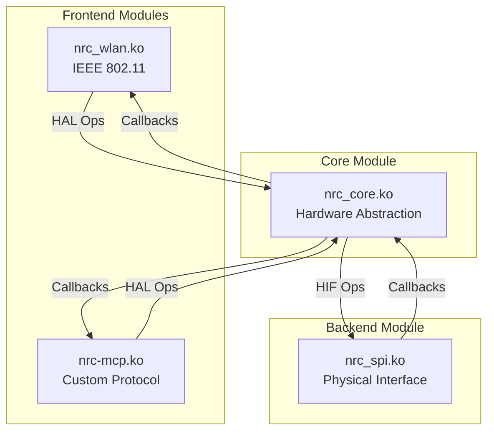
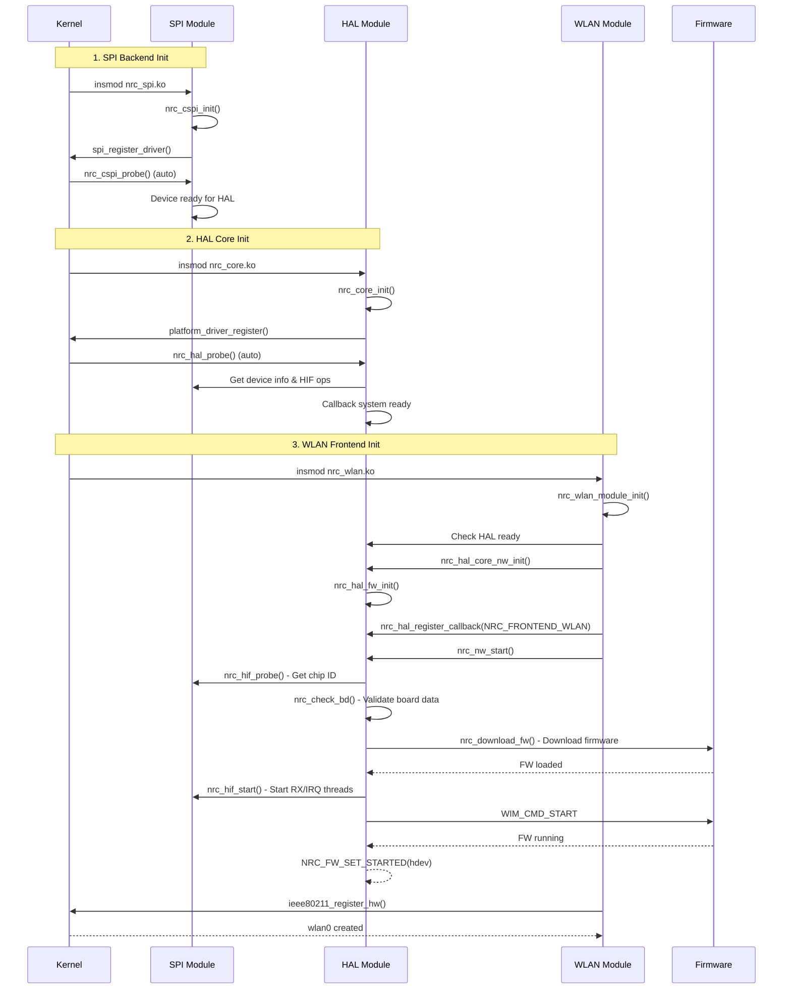
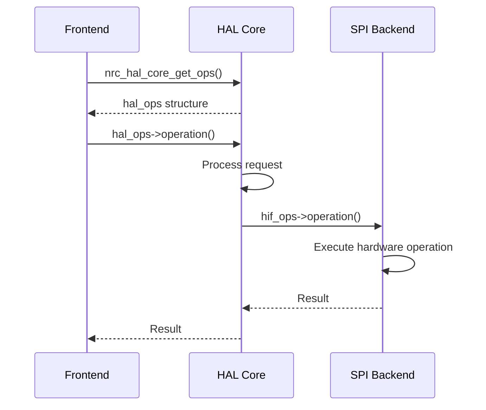
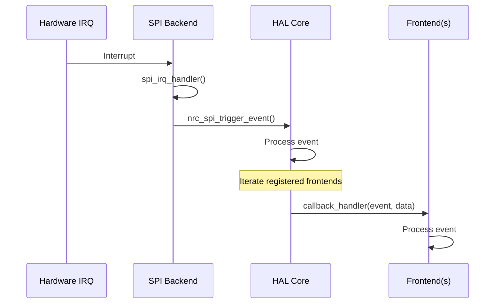

# NRC Modular Driver - Module System

## Module Architecture



## Loading Sequence

### Module Dependencies
```
nrc_spi.ko (backend)
    ↓
nrc_core.ko (HAL)
    ↓
nrc_wlan.ko OR nrc-mcp.ko (frontend)
```

### Standard WLAN Mode
```bash
insmod nrc_spi.ko
insmod nrc_core.ko
insmod nrc_wlan.ko
```

### MCP Mode
```bash
insmod nrc_spi.ko
insmod nrc_core.ko
insmod nrc-mcp.ko [mcp_priority=0|1]
```

### Unload Sequence (Reverse Order)
```bash
rmmod nrc_wlan  # or nrc_mcp
rmmod nrc_core
rmmod nrc_spi
```

## Initialization Flow

### Complete Initialization Sequence


### Key Initialization Steps

| Step | Module | Function | Purpose |
|------|--------|----------|---------|
| **1** | SPI | `nrc_cspi_init()` | Register SPI driver |
| **2** | SPI | `nrc_cspi_probe()` | Probe hardware, setup GPIO |
| **3** | HAL | `nrc_core_init()` | Register platform driver |
| **4** | HAL | `nrc_hal_probe()` | Get SPI device info, setup HIF |
| **5** | WLAN/MCP | `module_init()` | Frontend initialization |
| **6** | WLAN/MCP | `nrc_hal_core_nw_init()` | Network device setup |
| **7** | WLAN/MCP | `nrc_hal_register_callback()` | Register frontend callbacks |
| **8** | HAL | `nrc_nw_start()` | Start network stack |
| **9** | HAL | `nrc_download_fw()` | Download firmware |
| **10** | HAL | `nrc_hif_start()` | Start RX/IRQ processing |

## Module Interfaces

### SPI Backend

#### Key Exported Functions
```c
struct nrc_spi_device_info *nrc_spi_get_device_info(void);
bool nrc_spi_is_device_available(void);
struct nrc_hif_ops *nrc_spi_get_hif_ops(void);
int nrc_spi_register_callback(nrc_spi_callback_fn callback);
```

#### HIF Operations Categories
| Category | Key Operations |
|----------|----------------|
| **Device Control** | `probe`, `start`, `stop`, `config` |
| **Data Transfer** | `xmit`, `write`, `wait_for_xmit` |
| **Power Management** | `suspend`, `resume`, `wakeup` |
| **IRQ Handling** | `enable_irq`, `disable_irq`, `update` |
| **Thread Control** | `suspend_rx_thread`, `resume_rx_thread` |

### HAL Core

#### Key Exported Functions
```c
bool nrc_hal_core_is_init(void);
struct nrc_hif_device *nrc_hal_core_get_hdev(void);
int nrc_hal_core_nw_init(struct nrc *nw, struct nrc_hif_device *hdev);
struct nrc_hal_ops *nrc_hal_core_get_ops(void);
int nrc_hal_register_callback(enum nrc_frontend_type type,
                              nrc_hal_callback_fn callback);
```

#### HAL Operations Categories
| Category | Key Operations |
|----------|----------------|
| **Network Control** | `nw_start`, `nw_stop`, `nw_restart` |
| **Frame TX** | `xmit_wlan_frame`, `xmit_mcp_frame` |
| **WIM Protocol** | `wim_alloc_skb`, `wim_skb_add_tlv`, `wim_request` |
| **Board Data** | `bd_get_tx_pwr`, `bd_get_supp_ch_list` |
| **Power Save** | `ps_request_sleep`, `ps_request_wake` |

**Note**: All HAL operations have inline wrapper functions in `common/nrc-hal-core-interface.h`:
```c
static inline int nrc_hal_ops_xmit_wlan_frame(s8 vif_index, u16 aid, struct sk_buff *skb);
static inline int nrc_hal_ops_wim_request(struct sk_buff *skb, u16 cmd,
                                          int timeout, bool use_mcp_path,
                                          struct sk_buff **skb_resp);
```

### Frontend Modules

Both WLAN and MCP modules have **no exported functions** - complete layer separation achieved.

**Frontend Types**:
- `NRC_FRONTEND_WLAN` - IEEE 802.11 module
- `NRC_FRONTEND_MCP` - Custom protocol module

## Call Flow Patterns

### Frontend → HAL → SPI Pattern


### SPI → HAL → Frontend Event Pattern


## Callback System

### Callback Registration
```c
enum nrc_frontend_type {
    NRC_FRONTEND_WLAN = 0,
    NRC_FRONTEND_MCP = 1,
    NRC_FRONTEND_MAX
};

// Frontend registers with HAL
nrc_hal_register_callback(NRC_FRONTEND_WLAN, wlan_callback_handler);
nrc_hal_register_callback(NRC_FRONTEND_MCP, mcp_callback_handler);
```

### Backend Events (SPI → HAL)
| Event | Purpose |
|-------|---------|
| `NRC_BACKEND_EVT_IRQ` | Hardware interrupt |
| `NRC_BACKEND_EVT_RX_READY` | RX data available |
| `NRC_BACKEND_EVT_TX_COMPLETE` | TX completed |
| `NRC_BACKEND_EVT_ERROR` | Error occurred |
| `NRC_BACKEND_EVT_TARGET_NOTI_*` | Firmware notifications |

### Frontend Events (HAL → WLAN/MCP)
| Event | Purpose |
|-------|---------|
| `NRC_HAL_EVT_SPI_IRQ` | SPI interrupt received |
| `NRC_HAL_EVT_RX_READY` | Frame ready for processing |
| `NRC_HAL_EVT_TX_COMPLETE` | Transmission done |
| `NRC_HAL_EVT_ERROR` | Error occurred |
| `NRC_HAL_EVT_WIM_EVENT` | WIM event notification |
| `NRC_HAL_EVT_REG_NOTIFIER` | Regulatory domain change |
| `NRC_HAL_EVT_KICK_TXQ` | Resume TX queue |
| `NRC_HAL_EVT_CLEANUP_TXQ_ALL` | Cleanup all TX queues |
| `NRC_HAL_EVT_FREE_SKB` | Free SKB (HIF_TYPE_FRAME) |
| `NRC_HAL_EVT_PS_DYN_START_CUSTOM_TIMEOUT` | Start dynamic PS with custom timeout |
| `NRC_HAL_EVT_WAKE_DONE` | Wakeup sequence complete |
| `NRC_HAL_EVT_PS_ENTER_FAILED` | PS enter failed, recovery done |
| `NRC_HAL_EVT_TARGET_NOTI_FW_READY_FROM_WDT` | FW ready from WDT reset |
| `NRC_HAL_EVT_TARGET_NOTI_W_DISABLE_ASSERTED` | W_DISABLE asserted - connection loss |
| `NRC_HAL_EVT_TARGET_NOTI_TWT_SERVICE` | TWT service notification |
| `NRC_HAL_EVT_TARGET_NOTI_TWT_QUIET` | TWT quiet notification |

## Key Interfaces

### WIM Unified Request
```c
// Single unified function replaces 4 old functions
int nrc_hal_ops_wim_request(struct sk_buff *wim_skb,
                            u16 cmd,
                            u32 timeout,
                            bool use_mcp_path,
                            struct sk_buff **wim_resp);
```

**Parameters**:
- `wim_skb`: Pre-built WIM SKB (NULL for simple command)
- `cmd`: WIM command (required if wim_skb is NULL)
- `timeout`: Response timeout in ms (0 = fire-and-forget)
- `use_mcp_path`: Use MCP queue (true) or WLAN queue (false)
- `wim_resp`: Output response SKB (NULL if no response needed)

**Usage Examples**:
```c
// Fire-and-forget
nrc_hal_ops_wim_request(wim_skb, 0, 0, false, NULL);

// With response wait
struct sk_buff *resp = NULL;
nrc_hal_ops_wim_request(wim_skb, 0, 3000, false, &resp);

// Simple command with response
nrc_hal_ops_wim_request(NULL, WIM_CMD_GET, 3000, false, &resp);
```

### MCP Frame Transmission
```c
// MCP frame with optional HIF header
int nrc_hal_ops_xmit_mcp_frame(u8 subtype,
                               struct sk_buff *skb,
                               bool hif_header_included);
```

**Parameters**:
- `subtype`: `HIF_FRAME_SUB_MCP_DATA` or `HIF_FRAME_SUB_MCP_PROTOCOL`
- `skb`: Frame data
- `hif_header_included`: 
  - `false`: HAL adds HIF header (normal case)
  - `true`: HIF header already in SKB (raw packet)

## Module Parameters

### SPI Module
```c
module_param(spi_clock_speed, uint, 0644);  // SPI clock frequency
module_param(spi_mode, uint, 0644);         // SPI mode (0-3)
module_param(use_dma, bool, 0644);          // Enable DMA transfers
```

### HAL Module
```c
module_param(buffer_size, uint, 0644);      // HIF buffer size (1536)
module_param(credit_max, uint, 0644);       // Max credits per AC
```

### WLAN Module
```c
module_param(power_save, int, 0644);        // Power save mode
module_param(bss_max_idle, int, 0644);      // BSS max idle period
module_param(ndp_preq, int, 0644);          // NDP probe request
module_param(ampdu_max_agg, int, 0644);     // AMPDU aggregation
```

### MCP Module
```c
module_param(mcp_priority, int, 0644);      // MCP priority (0=parallel, 1=priority)
```

## Error Handling

### Initialization Errors

**SPI Module**:
- Device probe failure → Check hardware connection
- GPIO allocation failure → Verify GPIO configuration
- IRQ request failure → Check interrupt routing

**HAL Module**:
- SPI device not available → Ensure nrc_spi.ko loaded first
- HIF probe failure → Check chip ID and hardware status
- Firmware download failure → Verify firmware file and format

**WLAN Module**:
- HAL not initialized → Ensure nrc_core.ko loaded
- IEEE80211 registration failure → Check mac80211 subsystem
- Network start failure → Check firmware and hardware status

### Module Load Order Errors

**Incorrect Order**:
```bash
insmod nrc_wlan.ko  # FAILS - HAL not loaded
insmod nrc_core.ko  # FAILS - SPI not loaded
```

**Correct Order**:
```bash
insmod nrc_spi.ko   # Backend first
insmod nrc_core.ko  # HAL second
insmod nrc_wlan.ko  # Frontend last
```

## Debugging

### Check Module Status
```bash
# List loaded modules
lsmod | grep nrc

# Check dependencies
modinfo nrc_wlan.ko | grep depends
modinfo nrc_core.ko | grep depends
modinfo nrc_spi.ko | grep depends
```

### Verify Initialization
```bash
# Check kernel log
dmesg | grep -i nrc

# Expected messages:
# [nrc_spi] SPI device probed successfully
# [nrc_core] HAL initialized
# [nrc_wlan] WLAN module loaded
# [nrc_wlan] Firmware downloaded
# [nrc_wlan] wlan0 created
```

### Module Information
```bash
# Check exported symbols
cat /proc/kallsyms | grep nrc_hal
cat /proc/kallsyms | grep nrc_spi

# Check module info
modinfo nrc_core.ko
modinfo nrc_wlan.ko
modinfo nrc-mcp.ko
```

## Architecture Benefits

### Clean Separation
- **No exports** from frontend modules - complete layer isolation
- **Clear dependencies**: SPI → HAL → Frontend
- **Independent frontends**: WLAN and MCP can coexist

### Flexible Configuration
- **Load only needed modules**: WLAN or MCP
- **Module parameters**: Runtime configuration
- **Hot reload**: Unload/reload frontends without touching HAL/SPI

### Unified Interfaces
- **Single WIM function**: Simplified API
- **Inline wrappers**: Easy frontend usage
- **Callback system**: Event-driven architecture

## Related Documents

- [Architecture Overview](dev-overview-architecture.md) - System architecture
- [WLAN Layer](dev-layer-wlan.md) - WLAN frontend details
- [MCP Layer](dev-layer-mcp.md) - MCP frontend details
- [HAL Layer](dev-layer-hal.md) - HAL core implementation
- [SPI Layer](dev-layer-spi.md) - SPI backend implementation
