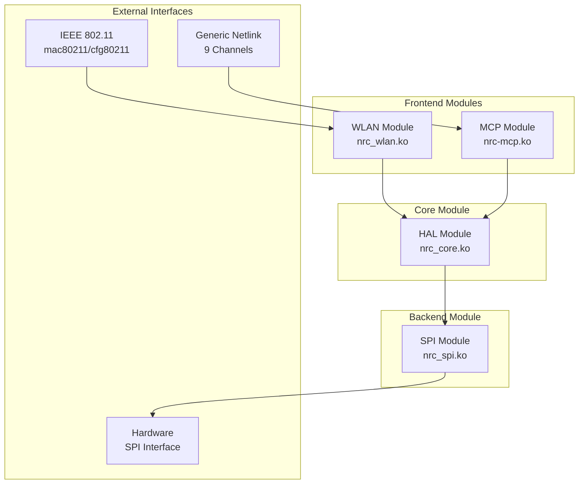
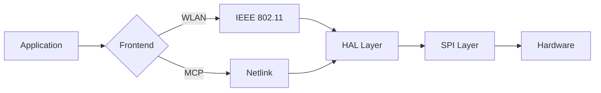
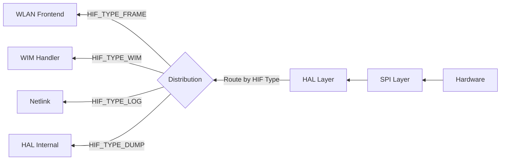

# NRC Modular Driver - Architecture Overview

## Module Architecture



## Module Responsibilities

### Frontend Layer
| Module | Purpose | Interface | Use Case |
|--------|---------|-----------|----------|
| **nrc_wlan.ko** | Standard Wi-Fi operations | IEEE 802.11 (mac80211) | Normal Wi-Fi connectivity |
| **nrc-mcp.ko** | Custom protocol support | Generic Netlink (9 channels) | Custom protocols, testing, management |

### Core Layer
| Module | Purpose | Interface |
|--------|---------|-----------|
| **nrc_core.ko** | Hardware abstraction, routing, WIM protocol | HAL operations, callbacks |

### Backend Layer
| Module | Purpose | Interface |
|--------|---------|-----------|
| **nrc_spi.ko** | Physical communication | SPI hardware interface |

## Data Flow Paths

### TX (Transmit) Path


### RX (Receive) Path


## Key Interfaces

### HAL Operations (hal_ops)
Frontend modules use HAL through operation structure:
```c
struct nrc_hal_ops {
    // Network device operations
    int (*nw_start)(bool restart);
    int (*nw_stop)(bool restart);
    void (*nw_restart)(void);
    
    // Frame transmission
    int (*xmit_wlan_frame)(s8 vif_index, u16 aid, struct sk_buff *skb);
    int (*xmit_mcp_frame)(int subtype, struct sk_buff *skb, bool hif_header_included);
    
    // WIM operations (basic)
    struct sk_buff* (*wim_alloc_skb)(u16 cmd, int size);
    void* (*wim_skb_add_tlv)(struct sk_buff *skb, u16 type, u16 len, void *tlv);
    int (*wim_request)(struct sk_buff *skb, u16 cmd, int timeout, 
                       bool use_mcp_path, struct sk_buff **skb_resp);
    
    // Power save operations
    int (*ps_request_sleep)(enum NRC_PS_MODE mode, u64 timeout,
                            struct cfg80211_wowlan *wowlan, enum NRC_PS_REASON reason);
    int (*ps_request_wake)(int timeout_ms, enum NRC_PS_REASON reason);
    
    // Board data operations
    struct wim_bd_param* (*bd_get_tx_pwr)(u8 *cc);
    struct bd_supp_param* (*bd_get_supp_ch_list)(void);
};
```

**Note**: WIM-specific functions for WLAN (e.g., `nrc_wim_wlan_set_sta_type`) are implemented directly in the WLAN module, not as HAL ops. This keeps protocol-specific logic in the appropriate frontend.

### Callback Registration
Frontends register callbacks to receive events from HAL:
```c
int nrc_hal_register_callback(enum nrc_frontend_type type,
                              struct nrc_wlan_callback *cb);
```

## Processing Contexts

| Context | Used By | Purpose |
|---------|---------|---------|
| **Process** | Netlink commands, module init | Synchronous operations |
| **Tasklet** | TX frame processing | Fast, non-blocking packet handling |
| **Workqueue** | Physical SPI TX/RX | Allows sleep, deferred processing |
| **IRQ** | Hardware events | Immediate hardware response |

## Flow Control Mechanisms

### Credit System (WLAN)
- **tx_credit[AC]**: Available credits per AC (updated by firmware)
- **tx_pend[AC]**: Pending frames counter
- **Available Credits**: `tx_credit[AC] - tx_pend[AC]`
- **Purpose**: Prevent buffer overflow at firmware side

### Slot System (SPI)
- **TX Slots**: 456 bytes per slot, host → firmware
- **RX Slots**: 492 bytes per slot, firmware → host
- **Tracking**: head (HW pointer), tail (SW pointer)
- **Purpose**: Manage SPI ring buffer capacity

### Priority Control (Optional)
- **MCP Priority**: When enabled, suspends WLAN TX during MCP transmission
- **Control**: `mcp_active` atomic flag
- **Default**: Disabled (parallel operation)

## HIF (Host Interface) Protocol

### HIF Header Structure
```c
struct hif {
    u8 type;      // HIF_TYPE_*
    u8 subtype;   // HIF_FRAME_SUB_*, HIF_WIM_SUB_*
    u8 vifindex;  // Virtual interface index
    u16 len;      // Payload length
    u8 tlv_len;   // TLV length (WIM only)
};
```

### HIF Types
| Type | Value | Purpose | Handled By |
|------|-------|---------|------------|
| **HIF_TYPE_FRAME** | 0 | 802.11 frames, MCP data | WLAN/MCP Frontend |
| **HIF_TYPE_WIM** | 1 | WIM commands/events | HAL/WLAN/MCP |
| **HIF_TYPE_LOG** | 2 | Firmware logs | Netlink |
| **HIF_TYPE_DUMP** | 3 | Memory dumps | HAL Internal |

### HIF Frame Subtypes
| Subtype | Purpose | Frontend |
|---------|---------|----------|
| **HIF_FRAME_SUB_WLAN** | 802.11 data frames | WLAN |
| **HIF_FRAME_SUB_MCP_DATA** | MCP data packets | MCP |
| **HIF_FRAME_SUB_MCP_PROTOCOL** | MCP protocol messages | MCP |

## WIM (Wireless Interface Message) Protocol

### WIM Structure
```c
struct wim {
    struct hif hif;         // HIF header
    u16 cmd;                // WIM command
    u16 seqno;              // Sequence number
    struct wim_tlv tlvs[];  // TLV payload
};
```

### WIM Message Types
| Type | Purpose | Response |
|------|---------|----------|
| **WIM_REQUEST** | Commands from host | Optional |
| **WIM_RESPONSE** | Command responses | N/A |
| **WIM_EVENT** | Firmware events | N/A |

### WIM Command Examples
- **Configuration**: SET, GET commands
- **Control**: START, STOP, RESTART
- **Events**: SCAN_COMPLETED, CSA, CREDIT_REPORT
- **Shell**: Execute firmware shell commands (netlink)

## Module Loading Sequence

### Standard WLAN Mode
```bash
insmod nrc_spi.ko
insmod nrc_core.ko
insmod nrc_wlan.ko
```

### MCP Mode
```bash
insmod nrc_spi.ko
insmod nrc_core.ko
insmod nrc-mcp.ko [mcp_priority=0|1]
```

### Dual Frontend Mode (if supported)
```bash
insmod nrc_spi.ko
insmod nrc_core.ko
insmod nrc_wlan.ko
insmod nrc-mcp.ko
```

## Key Design Principles

1. **Modularity**: Clean separation between frontend, core, and backend
2. **Flexibility**: Support multiple frontends (WLAN, MCP, future additions)
3. **Efficiency**: Asynchronous processing with proper context management
4. **Flow Control**: Credit and slot systems prevent buffer overruns
5. **Abstraction**: HAL layer hides hardware details from frontends

## Document Navigation

- **[Module System](dev-module-system.md)**: Module loading, initialization, interfaces
- **[WLAN Layer](dev-layer-wlan.md)**: IEEE 802.11 operations, MAC80211 integration
- **[MCP Layer](dev-layer-mcp.md)**: Custom protocol, netlink channels
- **[HAL Layer](dev-layer-hal.md)**: Hardware abstraction, routing, WIM protocol
- **[SPI Layer](dev-layer-spi.md)**: Physical interface, slot management

## Related Documents

- [Module System](dev-module-system.md)
- [Power Management](dev-power-management.md)
- [User Debug Guide](user-debug.md)
- [Kernel Integration](user-kernel-integration.md)
