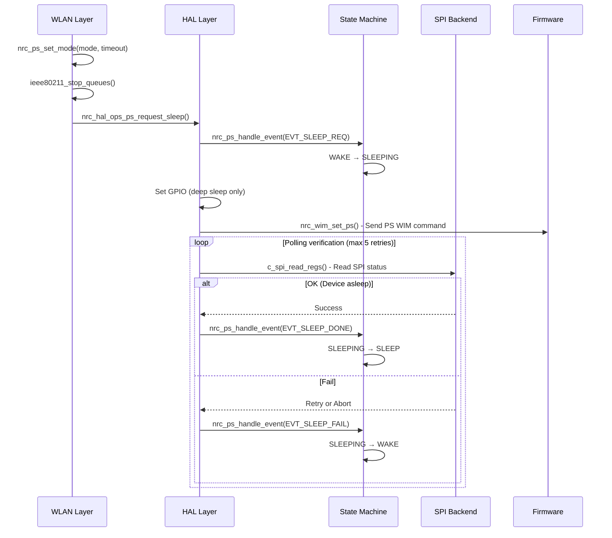
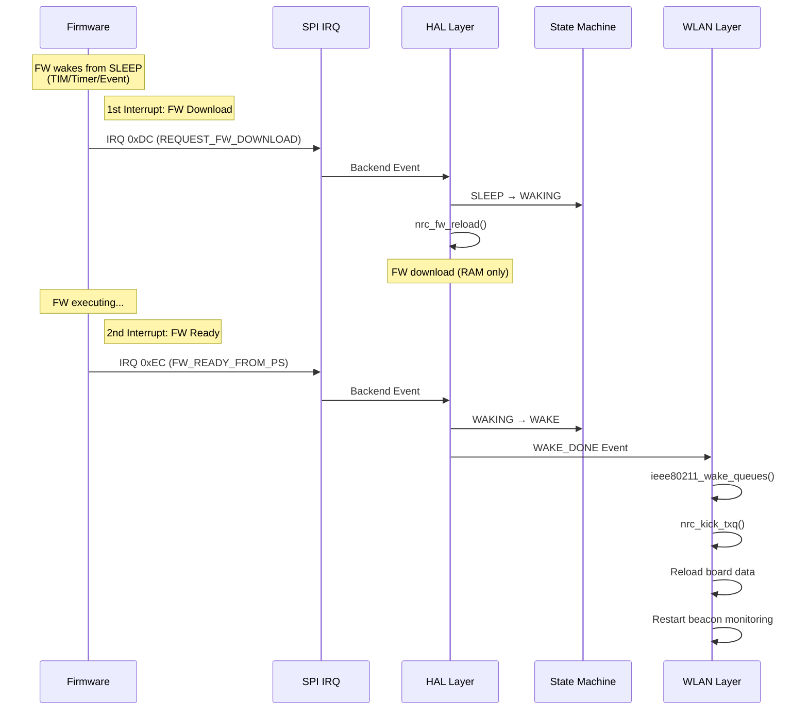

# Power Management System

## Overview

State machine-based power management with event-driven transitions.

---

## Power States & Modes

### States
| State | Description |
|-------|-------------|
| `NRC_PS_STATE_WAKE` | Device active |
| `NRC_PS_STATE_SLEEPING` | Transitioning to sleep (target still awake, TX allowed) |
| `NRC_PS_STATE_SLEEP` | Device in sleep mode (target asleep, wake required for TX) |
| `NRC_PS_STATE_WAKING` | Transitioning to wake |

### Modes
| Mode | Description |
|------|-------------|
| `NRC_PS_NONE` | No power save |
| `NRC_PS_MODEMSLEEP` | Modem sleep |
| `NRC_PS_DEEPSLEEP_TIM` | Deep sleep with TIM |
| `NRC_PS_DEEPSLEEP_NONTIM` | Deep sleep without TIM |

### Events
| Event | Trigger |
|-------|---------|
| `NRC_PS_EVT_SLEEP_REQ` | Sleep request |
| `NRC_PS_EVT_WAKE_REQ` | Wake request |
| `NRC_PS_EVT_FW_READY` | FW ready signal |
| `NRC_PS_EVT_SLEEP_DONE` | Sleep success |
| `NRC_PS_EVT_SLEEP_FAIL` | Sleep failure |
| `NRC_PS_EVT_TIMEOUT` | Operation timeout |

---

## Sleep Entry Flow



### Sleep Verification Mechanism

**Polling-Based Detection**:
- After sending WIM command, driver polls SPI status register
- Sleep verified when SPI ACK fails (device asleep)
- Max 5 retries with 10 polls each (5ms interval)

### Key Functions

**WLAN Layer** (`nrc-ps.c`)
```
nrc_ps_set_mode(mode, timeout, reason)
└─ nrc_hal_ops_ps_request_sleep()
```

**HAL Layer** (`nrc-ps.c`)
```
nrc_hal_ps_request_sleep(mode, timeout, wowlan, reason)
├─ nrc_ps_handle_event(EVT_SLEEP_REQ)     # WAKE → SLEEPING
├─ nrc_tx_flush_wq()                      # Flush TX workqueue before sleep
├─ nrc_hif_ops_gpio_set(gpio_num, 0)      # Deep sleep: Set GPIO LOW
│   └─ spi_hif_gpio_set()
├─ nrc_wim_set_ps_sync()                   # Send WIM + polling verification
├─ nrc_hif_ops_rx_thread_suspend()         # Deep sleep: Suspend RX thread
│   └─ spi_rx_thread_suspend()             # Park RX thread
└─ nrc_ps_handle_event(EVT_SLEEP_DONE)    # SLEEPING → SLEEP
```

**WIM Layer** (`wim.c`)
```
nrc_wim_set_ps_sync(mode, timeout, wowlan)
├─ nrc_wim_set_ps()                        # Send PS WIM command
└─ Polling loop (max 5 retries × 10 polls)
    ├─ nrc_hif_ops_ps_status()
    │   └─ spi_hif_ps_status()
    │       └─ c_spi_read_regs() - Read SPI status
    └─ Check result: OK (asleep) or Fail
```

**SPI Layer** (`nrc-spi-hif-ops.c`)
```
spi_rx_thread_suspend()                    # Called via nrc_hif_ops_rx_thread_suspend()
└─ kthread_park()                          # Park RX thread
    Note: IRQ remains enabled for FW wake-up signaling

spi_hif_ps_status()                        # Used by WIM layer for verification
└─ c_spi_read_regs() - Read SPI status register
    ├─ OK: SPI ACK fail (device asleep)
    └─ Fail: Retry or abort
```

**State Machine** (`nrc-ps.c`)
```
nrc_ps_handle_event(event_data)
├─ spin_lock_irqsave(&hdev->ps.lock)
├─ State transition logic
└─ spin_unlock_irqrestore(&hdev->ps.lock)
```

---

## Wake Flow

### 1. Active Wake (Host-Initiated)

**Simple GPIO Toggle - Then follows Passive Wake flow**

```
Host Driver (TX/RX request)
  └─ nrc_hal_ops_ps_request_wake()
      └─ nrc_ps_handle_event(EVT_WAKE_REQ)    # SLEEP → WAKING
      └─ nrc_hif_ops_gpio_set(gpio_num, 1)    # Toggle GPIO HIGH ← HOST WORK DONE
          └─ spi_hif_gpio_set()
          ↓
      [Target wakes up, follows Passive Wake flow below]
```

### 2. Passive Wake (FW-Initiated, Interrupt-Driven)

**Two-Interrupt Flow:**



**Function Chain:**

```
1st IRQ (0xDC): REQUEST_FW_DOWNLOAD
  spi_irq() → 0xDC detected
  └─ HAL: nrc_hal_handle_request_fw_download()
      ├─ State: SLEEP → WAKING
      └─ nrc_fw_reload()
          └─ FW download (RAM only, no XIP fusing)

2nd IRQ (0xEC): FW_READY_FROM_PS
  spi_irq() → 0xEC detected
  └─ HAL: nrc_ps_handle_fw_ready()
      ├─ State: WAKING → WAKE
      └─ Trigger WAKE_DONE event
          └─ WLAN: nrc_wlan_handle_wake_done()
              ├─ ieee80211_wake_queues()  # Wake IEEE80211 queues
              ├─ nrc_kick_txq()           # Retry pending TX
              ├─ Board data reload
              └─ Beacon monitoring restart
```

### 3. Comparison: Active vs Passive Wake

| Aspect | Active (Host) | Passive (FW) |
|--------|---------------|--------------|
| **Trigger** | Host TX/RX | FW TIM/Timer |
| **Host Action** | GPIO toggle only | None |
| **Interrupts** | 2 (0xDC, 0xEC) | 2 (0xDC, 0xEC) |
| **FW Download** | Yes (on 0xDC) | Yes (on 0xDC) |
| **State** | SLEEP → WAKING → WAKE | SLEEP → WAKING → WAKE |
| **Difference** | Host initiates with GPIO | FW initiates spontaneously |

---

## Key Functions

### State Machine Core

#### `nrc_ps_handle_event()` [nrc-ps.c]
```c
int nrc_ps_handle_event(struct nrc_hif_device *hdev,
                        struct nrc_ps_event_data *event_data)
```
- Atomic state transitions with spinlock
- All state changes go through this function
- Returns: 0 (success), 1 (no-op), negative (error)

### Sleep Operations

#### `nrc_hal_ps_request_sleep()` [nrc-ps.c]
```c
int nrc_hal_ps_request_sleep(enum NRC_PS_MODE mode, u64 timeout,
                             struct cfg80211_wowlan *wowlan,
                             enum NRC_PS_REASON reason)
```
- HAL master sleep handler - complete sleep sequence
- Checks driver state must be NRC_DRV_RUNNING before sleep
- Sequence:
  1. Check driver state (must be RUNNING)
  2. EVT_SLEEP_REQ → State: WAKE → SLEEPING
  3. Flush TX workqueue (`nrc_tx_flush_wq()`) - ensure pending TX complete
  4. GPIO control (deep sleep modes only) - signal sleep to FW
  5. WIM command with polling verification - confirm FW entered sleep
  6. RX thread suspend (deep sleep modes only) - park RX thread
  7. EVT_SLEEP_DONE → State: SLEEPING → SLEEP
- On failure: EVT_SLEEP_FAIL → WAKE, resume RX thread

#### `nrc_wim_set_ps_sync()` [wim.c]
```c
int nrc_wim_set_ps_sync(struct nrc_hif_device *hdev, enum NRC_PS_MODE mode,
                        u64 timeout, struct cfg80211_wowlan *wowlan)
```
- Send WIM PS command with retry (max 5 attempts)
- Polls `spi_hif_ps_status()` to verify sleep (max 10 polls, 5ms interval)
- Sleep verified by SPI ACK failure (ret=2) indicating device asleep
- `ps_duration`: Sleep timeout in ms (FW auto-wake)
- Returns: 0 (success), negative (failure)

### Wake Operations

#### `nrc_ps_request_wake()` [nrc-ps.c]
```c
int nrc_ps_request_wake(struct nrc_hif_device *hdev,
                       enum NRC_PS_REASON reason)
```
- Async wake for atomic context (TX tasklet safe)
- State machine transition: SLEEP → WAKING
- GPIO toggle immediate, no wait for completion
- Returns: 0 (success), 1 (already awake), negative (error)

#### `nrc_ps_request_wake_sync()` [nrc-ps.c]
```c
int nrc_ps_request_wake_sync(struct nrc_hif_device *hdev,
                             int timeout_ms,
                             enum NRC_PS_REASON reason)
```
- Sync wake with timeout (sleepable context only)
- Calls `nrc_ps_request_wake()` then waits for FW_READY
- Optional delay if device recently entered sleep (CONFIG_DELAY_WAKE_TARGET)
- Waits for `wake_done` completion with timeout
- Used for module shutdown and HIF stop operations
- Returns: 0 (success), -ETIMEDOUT (timeout), negative (error)

#### `nrc_ps_handle_fw_ready()` [nrc-ps.c]
```c
void nrc_ps_handle_fw_ready(void)
```
- Called by FW_READY_FROM_PS interrupt handler (IRQ 0xEC)
- Updates PS state: WAKING → WAKE via event system
- Records wake event for debugfs monitoring
- Signals completion for sync waiters: `complete_all(&hdev->wake_done)`
- Triggers HAL WAKE_DONE event to frontends
- **Note**: IEEE80211 queue wake and TXQ kick handled in `nrc_wlan_handle_wake_done()` callback

### HAL Interrupt Handlers

#### `nrc_hal_handle_request_fw_download()` [nrc-hal-callback.c]
```c
static bool nrc_hal_handle_request_fw_download(
    struct nrc_spi_event_data *backend_event,
    struct nrc_hal_event_data *hal_event)
```
- Handles FW download request interrupt (0xDC)
- **Safety check**: Verifies `hdev->fw.priv` is valid before proceeding
  - Protects against cleanup race condition during module unload
  - Returns early if FW structure already freed
- Calls `nrc_fw_reload()` to download firmware (lightweight, no XIP fusing)

#### `nrc_hal_handle_fw_ready_from_ps()` [nrc-hal-callback.c]
```c
static bool nrc_hal_handle_fw_ready_from_ps(
    struct nrc_spi_event_data *backend_event,
    struct nrc_hal_event_data *hal_event)
```
- Handles passive wake interrupt (0xEC)
- Sequence:
  1. `nrc_hif_reset_slot_credit()` (RAM mode only) - Reset slot/credit counters
  2. `nrc_ps_handle_fw_ready()` - Update PS state machine
  3. Forward `NRC_HAL_EVT_WAKE_DONE` to frontends
     - WLAN callback: `nrc_wlan_handle_wake_done()`
       - Wakes IEEE80211 queues: `ieee80211_wake_queues()`
       - Kicks TXQ: `nrc_kick_txq()` to retry pending TX frames
       - Reloads board data (if CONFIG_SUPPORT_BD)
       - Restarts beacon monitoring and dynamic PS

### SPI Interrupt Chain

#### `spi_irq()` [nrc-hif-cspi.c]
```c
static irqreturn_t spi_irq(int irq, void *dev_id)
```
- Hardware IRQ entry point
- Calls `spi_update_status()`

#### `spi_update_status()` [nrc-hif-cspi.c]
```c
static int spi_update_status(struct nrc_spi_priv *priv)
```
- Reads SPI status register
- Detects `TARGET_NOTI_FW_READY_FROM_PS` (0xEC)
- Triggers backend event

---

## Critical Rules

### Module Removal Wake Rule

**Device MUST be awake before `spi_stop()`**

```c
/* WLAN Cleanup (nrc-wlan-post-init.c) */
void nrc_wlan_post_hal_cleanup(bool restart)
{
    /* Wake device before cleanup if sleeping */
    if (hdev && NRC_PS_IS_ASLEEP(hdev)) {
        /* Extended timeout (5000ms) for cleanup to handle:
         * - Target wakeup and REQUEST_FW_DOWNLOAD IRQ processing
         * - FW ready verification (up to 3000ms)
         * - Any additional cleanup operations */
        nrc_ps_set_mode(nw, NRC_PS_NONE, 5000, NULL,
                        NRC_PS_REASON_HAL_SHUTDOWN);
    }
    // ... cleanup continues
}
```

**Why:**
- SPI commands fail if device asleep
- IRQ must be disabled while device responsive
- Prevents module removal hangs

---

## System Architecture

```
WLAN Layer (nrc_wlan.ko)
    ↓ HAL ops
HAL Layer (nrc_core.ko)
    ↓ HIF ops
SPI Layer (nrc_spi.ko)
    ↓ Hardware IRQ
Firmware
```

**Control Flow**: WLAN → HAL → FW (top-down)
**Notification Flow**: FW → SPI → HAL → WLAN (bottom-up, interrupt-driven)

---

## Summary

**Wake Request Types:**

1. **Active Wake (Host-Initiated)**
   - Trigger: WLAN TX/RX, user request
   - State: SLEEP → WAKING → WAKE
   - GPIO: Yes
   - Wait: Sync/async

2. **Passive Wake (FW-Initiated)**
   - Trigger: TIM beacon, timer, FW event
   - State: SLEEP → WAKE (direct)
   - GPIO: No (FW already awake)
   - Interrupt: 0xEC (TARGET_NOTI_FW_READY_FROM_PS)

**Key Architecture:**
- Single entry point: `nrc_ps_handle_event()`
- Atomic state transitions (spinlock)
- Event-driven design
- Unidirectional control: top-down
- Interrupt notifications: bottom-up